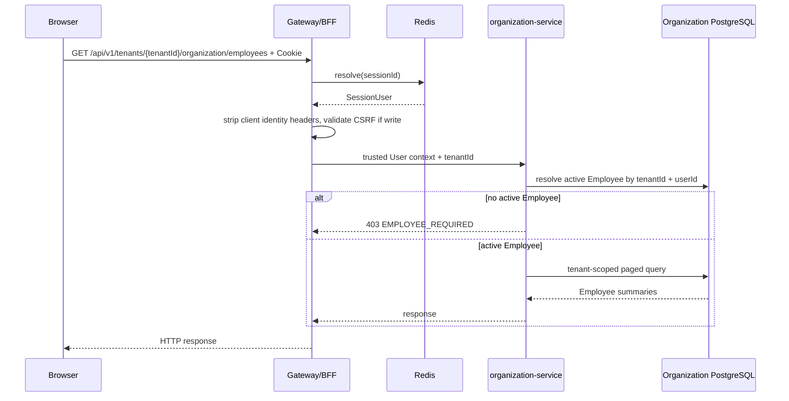
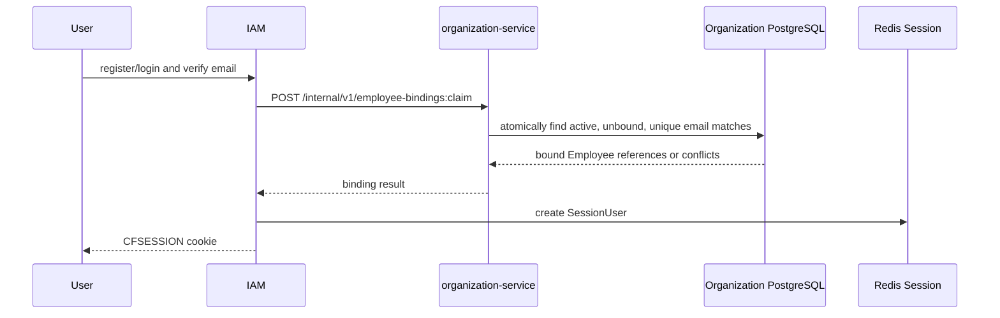
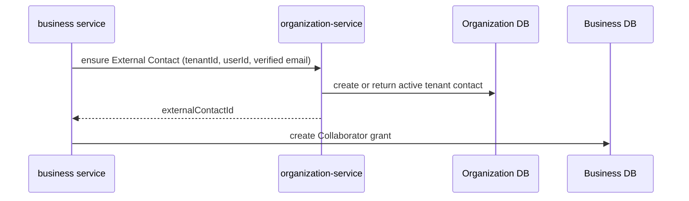
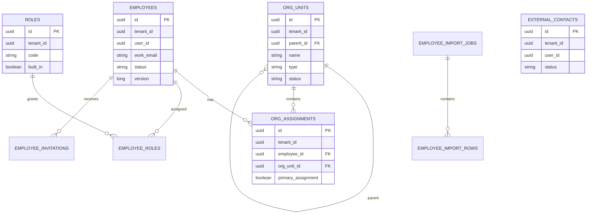

# 通讯录-技术设计与开发手册

| 项目 | 内容 |
| --- | --- |
| 状态 | 已确认，待实现 |
| 技术负责人 | 待指定 |
| 最后更新 | 2026-07-19 |
| 关联 PRD | [通讯录-需求文档](../product/organization-directory-prd.md) |
| 目标版本 | MVP |

## 1. 摘要

新增独立 `organization-service`，作为 Tenant 内 OrgUnit、Employee、OrgAssignment、External Contact 和租户级角色的唯一事实源。浏览器只持有统一 Gateway/BFF 的 Redis Session Cookie；Gateway 建立可信 `SessionUser` 上下文，organization-service 根据显式 `tenantId` 和 `userId` 在本地完成 Employee 状态、角色、接口权限与数据隔离校验。IAM 不拥有 Employee，不参与通讯录业务请求。内部服务接口在 MVP 中依赖 Kubernetes 内部可信网络，不使用 Cookie 或 Service Token。

## 2. 输入与范围

### 2.1 PRD 需求映射

| PRD 需求 | 技术实现位置 | 验证方式 |
| --- | --- | --- |
| FR-001、FR-003 | `OrganizationModule`、OrgUnit/OrgAssignment 表 | 模块测试、数据库约束测试 |
| FR-002、FR-004、FR-007 | `EmployeeModule`、Employee 绑定接口 | 模块、并发和 HTTP 集成测试 |
| FR-005 | `DirectoryQuery` | PostgreSQL 查询和 HTTP 测试 |
| FR-006 | `OrganizationAuthorization`、Role 表 | 权限矩阵测试 |
| FR-008、FR-009 | `ExternalContactModule`、内部 ensure/resolve 接口 | 契约和跨服务场景测试 |
| FR-010 | `EmployeeImportModule` | 文件校验、事务和恢复测试 |
| FR-011 | Gateway `SessionResolver`、可信用户上下文 | Redis Session 和伪造头测试 |
| FR-012 | `OrganizationAudit`、Outbox | 审计完整性和事务测试 |

### 2.2 非目标

- 不实现 Tenant、User、密码、第三方身份和平台角色。
- 不实现业务资源 Collaborator 表或资源级授权。
- 不引入服务身份 Token、mTLS、Service Mesh 或第三方 Open API。
- 不引入搜索引擎、第三方 HR Adapter、自定义租户角色和组织范围授权。
- 不让其他应用读取 organization-service 数据库或导入其 JPA 实体。

## 3. 当前状态与差距

既有设计曾假设 IAM 拥有用户与 Tenant 的关系、Current Tenant 选择及 tenant-scoped JWT；`shared/security` 也从 JWT 的 `tenant_id` 和 `permissions` 声明构造安全上下文。目标设计改用 Employee/External Contact、统一 Session 与服务内本地授权，不再使用用户 Tenant Token。本技术设计是该目标的最终技术决策来源。

实现前必须：

- 删除或迁移 IAM 中旧用户 Tenant 关系、Tenant Role 和租户 Token 相关实现。
- 将 `shared/security` 从 JWT 转换器重构为 Session User Context、Current Tenant 路径解析和内部可信上下文 Adapter。
- 将 Gateway 从纯路由应用扩展为统一 BFF Session 执行点。
- 新增 organization-service 及独立 PostgreSQL 逻辑数据库。
- 删除旧用户 Tenant 关系和 JWT 运行路径，不能让两套鉴权机制并存。

## 4. 架构与职责

### 4.1 应用职责

| 应用 | 拥有的数据 | 负责 | 不负责 |
| --- | --- | --- | --- |
| IAM | User、凭据、全局 User 状态 | 登录、User 资料、创建/更新/撤销 Session | Employee、组织、资源权限 |
| Gateway/BFF | 无领域数据；读取 Redis Session | Cookie、Session 解析、CSRF、可信用户上下文、路由 | Employee 与业务权限判断 |
| organization-service | OrgUnit、Employee、OrgAssignment、External Contact、Tenant Role、导入和审计 | Tenant 人员事实、通讯录权限、搜索、内部人员解析 | Tenant 生命周期、User 凭据、业务 Collaborator |
| 业务服务 | 自己的业务资源和 Collaborator | 资源授权与数据返回 | Employee 资料和全 Tenant 通讯录 |
| Redis | Session 临时状态 | 保存 `SessionUser` 与 Session 索引 | 领域事实和业务授权 |

### 4.2 organization-service 模块

| 模块 | 主要接口 | 调用方 | 核心不变量 |
| --- | --- | --- | --- |
| `OrganizationModule` | 创建、移动、停用 OrgUnit；维护任职 | 用户 HTTP Adapter、导入模块 | 单父级、无环、单一主任职 |
| `EmployeeModule` | 创建、更新、绑定、停用、离职、恢复 | 用户和内部 HTTP Adapter | Tenant 内邮箱唯一，User/Employee 一对一 |
| `DirectoryQuery` | 组织树、Employee 搜索和名片查询 | 用户 HTTP Adapter | 默认只返回活动 Employee，始终 Tenant-scoped |
| `OrganizationAuthorization` | `requireEmployee`、`requireSuperAdmin`、`resolveSubject` | 所有应用用例 | External Contact 不能进入通讯录接口 |
| `ExternalContactModule` | ensure、停用、启用、最小名片 | 用户和内部 HTTP Adapter | Tenant + User 唯一，不拥有资源权限 |
| `EmployeeImportModule` | 校验、预览、提交、结果下载 | 用户 HTTP Adapter | 校验失败不修改正式数据 |
| `OrganizationAudit` | 记录管理行为与状态变化 | 写用例 | 与业务变更同一事务 |

HTTP、JPA、RabbitMQ、文件解析和 Redis 均为 Adapter，不进入模块接口。测试优先通过上述模块接口和 HTTP 外部行为执行。

### 4.3 Session 与通讯录读取



### 4.4 Employee 邮箱绑定



`employee-bindings:claim` 是唯一允许跨 Tenant 按已验证邮箱查找的内部接口。它不返回通讯录数据，只返回绑定成功的 `tenantId/employeeId` 和冲突类型；必须使用专用平台操作事务上下文，并有独立审计。

### 4.5 External Contact 与业务 Collaborator



如果 External Contact 创建成功而资源授权失败，保留没有资源权限的 External Contact 是安全的；重试使用邀请 ID 作为幂等键。反向顺序禁止，因为它可能短暂创建一个无法执行 Tenant 状态校验的 Collaborator。

## 5. 认证、授权与租户隔离

### 5.1 Browser Session

- Cookie 名称：`CFSESSION`，Host-only、`HttpOnly`、`Secure`、`SameSite=Lax`、`Path=/`。
- 登录成功后轮换 Session ID；写请求使用同步 Token 或 Cookie-to-header CSRF 防护。
- Redis Key 命名空间：`cf:{env}:gateway:session:*`。
- 建议空闲超时 8 小时、绝对超时 24 小时；MVP 不实现 Remember Me。
- IAM 创建、更新和删除 Session；Gateway 读取并刷新访问时间。
- 使用 `userId -> sessionId[]` 索引。User 全局禁用时 IAM 同步删除其全部 Session。

Redis 中保存版本化 DTO，不保存 JPA Entity：

```text
SessionUser v1
- userId: UUID
- displayName: String
- primaryEmail: String
- avatarUrl: nullable String
- userStatus: ACTIVE
- userVersion: long
- authenticatedAt: Instant
```

User 资料修改后，IAM 更新 PostgreSQL，再同步更新该 User 的所有 Session 快照。业务服务不得使用 Session 中的显示信息推导 Employee、角色或资源权限。

### 5.2 Gateway 可信上下文

- Gateway 拒绝无效 Session，返回 `401 SESSION_REQUIRED`。
- Gateway 删除浏览器提交的全部 `X-CloudForge-*` 身份头。
- Gateway 向下游提供版本化 `AuthenticatedUserContext`；organization-service 至少只依赖 `userId`。
- 禁止转发 Cookie、Session ID 或 Redis Key 给下游。
- 可信上下文只在集群内部传递，并从访问日志中脱敏邮箱等字段。

### 5.3 organization-service 授权顺序

1. 从路径解析唯一 `tenantId`。
2. 从 Gateway 可信上下文解析 `userId`。
3. 本地解析活动 Employee 或 External Contact。
4. 用户通讯录接口调用 `requireEmployee`。
5. 管理接口继续调用 `requireSuperAdmin`。
6. 在授权完成后执行带 `tenant_id` 的数据库查询。

普通活动 Employee 无需 Role 即可读取工作通讯录。`SUPER_ADMIN` 通过 `employee_roles` 关系获得管理能力。External Contact 只能调用明确开放的自助接口；组织树和 Employee 接口一律拒绝。

### 5.4 内部服务互信

MVP 不使用 Service Token，内部调用不携带 Browser Cookie：

- organization-service 仅通过 ClusterIP 暴露，不能拥有公网 Ingress。
- Gateway 只路由白名单 `/api/v1/.../organization/**`，不路由 `/internal/**`。
- NetworkPolicy 只允许 CloudForge 应用命名空间访问内部服务。
- 内部调用显式传递 `tenantId`；代表用户时显式传递 `actorUserId`。
- organization-service 信任内部调用方提供的 Actor，并记录调用源、Actor 和 correlationId。

这是已接受的 MVP 风险：任一受信任内部工作负载被攻陷后可以伪造 Actor。引入第三方工作负载、跨团队命名空间或更高安全等级前，必须增加工作负载身份和接口能力校验。

### 5.5 数据隔离

- 每张 Tenant-owned 表都包含非空 `tenant_id`。
- 用户和内部 Tenant API 必须在事务开始时设置 `app.current_tenant`。
- JPA 查询显式包含 Tenant 条件；PostgreSQL RLS 是第二层保护，不替代应用条件。
- 跨 Tenant 邮箱绑定使用单独的平台操作事务上下文，禁止复用到通用 Repository。
- 找不到或无权查看某个对象时统一返回 `404`，避免跨 Tenant 枚举；缺少 Tenant 主体或角色时返回 `403`。

## 6. 数据模型

### 6.1 关系图



### 6.2 表定义

所有时间使用 `timestamptz`，所有业务表包含 `created_at`、`created_by`、`updated_at`、`updated_by`；以下省略重复审计列。

#### `org_units`

| 字段 | 类型 | 可空 | 约束 | 说明 |
| --- | --- | --- | --- | --- |
| `id` | `uuid` | 否 | PK | OrgUnit 永久标识 |
| `tenant_id` | `uuid` | 否 | RLS、索引 | Tenant |
| `parent_id` | `uuid` | 是 | 同 Tenant FK | 根节点为空 |
| `name` | `varchar(128)` | 否 | 非空 | 显示名称 |
| `type` | `varchar(32)` | 否 | CHECK | `COMPANY/DIVISION/DEPARTMENT/TEAM` |
| `status` | `varchar(16)` | 否 | CHECK | `ACTIVE/DISABLED` |
| `sort_order` | `integer` | 否 | `>= 0` | 同级排序 |
| `version` | `bigint` | 否 | 乐观锁 | 并发更新 |

索引与约束：

- `(tenant_id, parent_id, sort_order, id)` 支持树查询。
- `(tenant_id, parent_id, lower(name))` 唯一，避免同级重名。
- 移动节点时在事务内检测自身、后代和跨 Tenant 父节点。
- 有活动子节点或 OrgAssignment 时只允许停用，不允许硬删除。

#### `employees`

| 字段 | 类型 | 可空 | 约束 | 说明 |
| --- | --- | --- | --- | --- |
| `id` | `uuid` | 否 | PK | Employee 永久标识 |
| `tenant_id` | `uuid` | 否 | RLS、索引 | Tenant |
| `user_id` | `uuid` | 是 | 唯一条件索引 | IAM User 引用，无跨库 FK |
| `employee_no` | `varchar(64)` | 是 | Tenant 内唯一条件索引 | 工号 |
| `display_name` | `varchar(128)` | 否 | 非空 | 工作名片姓名 |
| `work_email` | `varchar(320)` | 否 | Tenant 内唯一 | 原始标准化邮箱 |
| `work_phone` | `varchar(32)` | 是 |  | 工作电话 |
| `avatar_url` | `varchar(1024)` | 是 |  | 头像 URL |
| `status` | `varchar(16)` | 否 | CHECK | `ACTIVE/DISABLED/DEPARTED` |
| `departed_at` | `timestamptz` | 是 | 状态一致性 CHECK | 离职时间 |
| `version` | `bigint` | 否 | 乐观锁 | 并发更新 |

索引与约束：

- `UNIQUE (tenant_id, lower(work_email))`。
- `UNIQUE (tenant_id, user_id) WHERE user_id IS NOT NULL`。
- `UNIQUE (tenant_id, employee_no) WHERE employee_no IS NOT NULL`。
- `pg_trgm` GIN 索引用于 `display_name`、`work_email`；工号使用 B-tree。
- `DEPARTED` 必须有 `departed_at`；其他状态必须为空。
- 不提供硬删除业务接口。

#### `org_assignments`

| 字段 | 类型 | 可空 | 约束 | 说明 |
| --- | --- | --- | --- | --- |
| `id` | `uuid` | 否 | PK | 任职标识 |
| `tenant_id` | `uuid` | 否 | RLS | Tenant |
| `employee_id` | `uuid` | 否 | 同 Tenant FK | Employee |
| `org_unit_id` | `uuid` | 否 | 同 Tenant FK | OrgUnit |
| `primary_assignment` | `boolean` | 否 | 条件唯一 | 是否主任职 |
| `title` | `varchar(128)` | 是 |  | 岗位/职务 |
| `started_on` | `date` | 是 |  | 开始日期 |
| `ended_on` | `date` | 是 | CHECK | 结束日期 |
| `status` | `varchar(16)` | 否 | CHECK | `ACTIVE/ENDED` |
| `version` | `bigint` | 否 | 乐观锁 | 并发更新 |

- `UNIQUE (tenant_id, employee_id) WHERE primary_assignment AND status='ACTIVE'`。
- `UNIQUE (tenant_id, employee_id, org_unit_id) WHERE status='ACTIVE'`。
- Employee 创建事务必须同时创建主任职；替换主任职在一个模块操作中完成。

#### `external_contacts`

| 字段 | 类型 | 可空 | 约束 | 说明 |
| --- | --- | --- | --- | --- |
| `id` | `uuid` | 否 | PK | External Contact 标识 |
| `tenant_id` | `uuid` | 否 | RLS | Tenant |
| `user_id` | `uuid` | 否 | Tenant 内唯一 | 已认证 User |
| `display_name` | `varchar(128)` | 否 |  | 显示名称 |
| `email` | `varchar(320)` | 否 |  | 已验证邮箱快照 |
| `company_name` | `varchar(256)` | 是 |  | 所属公司 |
| `status` | `varchar(16)` | 否 | CHECK | `ACTIVE/DISABLED` |
| `disabled_at` | `timestamptz` | 是 | 状态一致性 CHECK | 停用时间 |
| `disabled_by` | `uuid` | 是 |  | 操作 Employee |
| `version` | `bigint` | 否 | 乐观锁 | 并发更新 |

- `UNIQUE (tenant_id, user_id)`。
- 不存在 `org_unit_id`、Employee 角色或资源权限字段。
- ensure 操作以 `(tenant_id, user_id)` 为业务幂等键。

#### `roles`

| 字段 | 类型 | 可空 | 约束 | 说明 |
| --- | --- | --- | --- | --- |
| `id` | `uuid` | 否 | PK | Role 标识 |
| `tenant_id` | `uuid` | 否 | RLS | Tenant |
| `code` | `varchar(64)` | 否 | Tenant 内唯一 | MVP 仅 `SUPER_ADMIN` |
| `name` | `varchar(128)` | 否 |  | 超级管理员 |
| `built_in` | `boolean` | 否 | 必须 true | 预置角色 |
| `status` | `varchar(16)` | 否 | CHECK | `ACTIVE` |

MVP 不提供 Role 创建、删除和权限配置接口。Tenant 初始化时幂等创建 `SUPER_ADMIN`。

#### `employee_roles`

| 字段 | 类型 | 可空 | 约束 | 说明 |
| --- | --- | --- | --- | --- |
| `tenant_id` | `uuid` | 否 | RLS、复合 PK | Tenant |
| `employee_id` | `uuid` | 否 | 复合 PK、同 Tenant FK | Employee |
| `role_id` | `uuid` | 否 | 复合 PK、同 Tenant FK | Role |
| `assigned_by` | `uuid` | 否 |  | 操作者 Employee |
| `assigned_at` | `timestamptz` | 否 |  | 分配时间 |

- 不能移除 Tenant 最后一个活动 SUPER_ADMIN。
- `DISABLED/DEPARTED` Employee 即使保留角色关系也不能执行管理操作。

#### `employee_invitations`

| 字段 | 类型 | 可空 | 约束 | 说明 |
| --- | --- | --- | --- | --- |
| `id` | `uuid` | 否 | PK | 邀请标识 |
| `tenant_id` | `uuid` | 否 | RLS | Tenant |
| `employee_id` | `uuid` | 否 | 同 Tenant FK | 目标 Employee |
| `email` | `varchar(320)` | 否 |  | 邀请目标邮箱 |
| `token_hash` | `varchar(128)` | 否 | 唯一 | 不保存明文 Token |
| `status` | `varchar(16)` | 否 | CHECK | `PENDING/ACCEPTED/EXPIRED/REVOKED` |
| `expires_at` | `timestamptz` | 否 |  | 有效期 |
| `accepted_by_user_id` | `uuid` | 是 |  | 接受 User |
| `accepted_at` | `timestamptz` | 是 |  | 接受时间 |

- 同一 Employee 同时最多一个有效 `PENDING` 邀请。
- 接受操作在绑定事务中使用行锁并保证一次性。

#### `employee_import_jobs`

| 字段 | 类型 | 可空 | 约束 | 说明 |
| --- | --- | --- | --- | --- |
| `id` | `uuid` | 否 | PK | 导入任务 |
| `tenant_id` | `uuid` | 否 | RLS | Tenant |
| `status` | `varchar(16)` | 否 | CHECK | `VALIDATING/READY/COMMITTING/COMPLETED/FAILED/CANCELLED` |
| `file_name` | `varchar(255)` | 否 |  | 脱敏文件名 |
| `file_checksum` | `varchar(64)` | 否 |  | 幂等与审计 |
| `total_rows` | `integer` | 否 | `>=0` | 总行数 |
| `valid_rows` | `integer` | 否 | `>=0` | 有效行 |
| `error_rows` | `integer` | 否 | `>=0` | 错误行 |
| `created_by_employee_id` | `uuid` | 否 |  | 发起人 |
| `version` | `bigint` | 否 | 乐观锁 | 防止重复提交 |

#### `employee_import_rows`

| 字段 | 类型 | 可空 | 约束 | 说明 |
| --- | --- | --- | --- | --- |
| `job_id` | `uuid` | 否 | 复合 PK | 导入任务 |
| `row_number` | `integer` | 否 | 复合 PK | 原文件行号 |
| `operation` | `varchar(16)` | 否 | CHECK | `CREATE/UPDATE/SKIP` |
| `normalized_payload` | `jsonb` | 否 |  | 通过白名单的工作字段 |
| `errors` | `jsonb` | 否 |  | 结构化错误码 |
| `committed_employee_id` | `uuid` | 是 |  | 提交结果 |

`organization_audit_logs`、`outbox_events` 和 `inbox_messages` 按平台标准建立；审计日志只追加，不支持业务删除。

### 6.3 状态机与并发

- Employee：`ACTIVE -> DISABLED -> ACTIVE`、`ACTIVE|DISABLED -> DEPARTED -> ACTIVE`。
- External Contact：`ACTIVE -> DISABLED -> ACTIVE`。
- 乐观锁冲突返回 `409 CONCURRENT_MODIFICATION`，客户端必须刷新后重试。
- 邮箱绑定、邀请接受、ensure External Contact 和导入提交均为幂等模块操作。
- User 邮箱绑定并发依赖 Employee 行锁及 `(tenant_id, user_id)` 唯一约束，唯一冲突转为领域错误，不返回数据库异常。

## 7. HTTP 接口

### 7.1 用户应用接口

所有路径通过 Gateway 暴露，`tenantId` 必须存在于路径；`userId` 不允许出现在请求参数中。

| 方法与路径 | 权限 | 请求/响应摘要 | 主要错误 |
| --- | --- | --- | --- |
| `GET /api/v1/tenants/{tenantId}/organization/units/tree` | Employee | 完整活动组织树 | `EMPLOYEE_REQUIRED` |
| `POST /api/v1/tenants/{tenantId}/organization/units` | SUPER_ADMIN | 创建 OrgUnit | `ORG_UNIT_PARENT_NOT_FOUND` |
| `PATCH /api/v1/tenants/{tenantId}/organization/units/{id}` | SUPER_ADMIN | 重命名、排序、移动、停用 | `ORG_UNIT_CYCLE`、`CONCURRENT_MODIFICATION` |
| `GET /api/v1/tenants/{tenantId}/organization/employees` | Employee | 游标分页和搜索 | `INVALID_CURSOR` |
| `GET /api/v1/tenants/{tenantId}/organization/employees/{id}` | Employee | 工作名片和任职 | `EMPLOYEE_NOT_FOUND` |
| `POST /api/v1/tenants/{tenantId}/organization/employees` | SUPER_ADMIN | 创建 Employee + 主任职 | `EMPLOYEE_EMAIL_CONFLICT` |
| `PATCH /api/v1/tenants/{tenantId}/organization/employees/{id}` | SUPER_ADMIN | 更新工作信息 | `CONCURRENT_MODIFICATION` |
| `PUT /api/v1/tenants/{tenantId}/organization/employees/{id}/assignments` | SUPER_ADMIN | 原子替换任职集合 | `PRIMARY_ASSIGNMENT_REQUIRED` |
| `POST /api/v1/tenants/{tenantId}/organization/employees/{id}/invitations` | SUPER_ADMIN | 创建或重发邀请 | `EMPLOYEE_ALREADY_BOUND` |
| `POST /api/v1/tenants/{tenantId}/organization/employees/{id}:disable` | SUPER_ADMIN | 停用 Employee | `LAST_SUPER_ADMIN` |
| `POST /api/v1/tenants/{tenantId}/organization/employees/{id}:depart` | SUPER_ADMIN | Employee 离职 | `LAST_SUPER_ADMIN` |
| `POST /api/v1/tenants/{tenantId}/organization/employees/{id}:restore` | SUPER_ADMIN | 恢复/重新入职 | `EMPLOYEE_EMAIL_CONFLICT` |
| `GET /api/v1/tenants/{tenantId}/organization/external-contacts` | SUPER_ADMIN | 分页管理列表 | `SUPER_ADMIN_REQUIRED` |
| `POST /api/v1/tenants/{tenantId}/organization/external-contacts/{id}:disable` | SUPER_ADMIN | 全 Tenant 停用 | `EXTERNAL_CONTACT_NOT_FOUND` |
| `POST /api/v1/tenants/{tenantId}/organization/external-contacts/{id}:enable` | SUPER_ADMIN | 重新启用 | `EXTERNAL_CONTACT_NOT_FOUND` |
| `POST /api/v1/tenants/{tenantId}/organization/imports` | SUPER_ADMIN | 上传并开始校验 | `IMPORT_FILE_INVALID` |
| `GET /api/v1/tenants/{tenantId}/organization/imports/{id}` | SUPER_ADMIN | 预览和错误汇总 | `IMPORT_NOT_FOUND` |
| `POST /api/v1/tenants/{tenantId}/organization/imports/{id}:commit` | SUPER_ADMIN | 原子提交 | `IMPORT_NOT_READY` |

### 7.2 内部服务接口

内部路径不得由 Gateway 或公网 Ingress 路由。MVP 依赖内部网络互信；调用方必须传递 correlationId。

| 方法与路径 | 用途 | 请求 | 响应 | 幂等性 |
| --- | --- | --- | --- | --- |
| `POST /internal/v1/tenants/{tenantId}/subjects:resolve` | 业务服务验证 Tenant 主体 | `actorUserId` | subject type/id/status/roles | 只读 |
| `POST /internal/v1/tenants/{tenantId}/people:batch-get` | 业务服务获取已知参与者最小名片 | subject refs，最多 100 | 最小名片，保持输入顺序 | 只读 |
| `PUT /internal/v1/tenants/{tenantId}/external-contacts/by-user/{userId}` | 接受资源邀请后 ensure | verified email、display name、inviteId | External Contact ref | `(tenantId,userId)` |
| `POST /internal/v1/employee-bindings:claim` | IAM 按已验证邮箱绑定 Employee | userId、verifiedEmail | 绑定结果和冲突，不含名片 | `(userId,email)` |
| `POST /internal/v1/tenants/{tenantId}:bootstrap` | Tenant 创建后初始化根节点和管理员 | tenant name、owner User | root OrgUnit/Employee refs | `tenantId` |

`subjects:resolve` 只回答 Tenant 主体事实，不返回业务资源权限。`people:batch-get` 只能按调用方已经持有的 subject refs 查询，不能提供全 Tenant 搜索或列表能力。

### 7.3 接口约定

- JSON 使用 lower camel case，时间为 UTC RFC 3339，ID 为 UUID 字符串。
- 游标是不透明、签名或完整性保护的 Base64URL 值；默认 50，最大 200。
- 写接口要求 `If-Match`/`version`，并使用 `Idempotency-Key` 保护邀请、ensure、导入提交等可重试操作。
- 错误体固定包含 `code`、`message`、`correlationId` 和可选 `fieldErrors`，不返回堆栈、SQL 或其他 Tenant 标识。
- 用户接口信任 Gateway User Context；内部接口不得接收或转发 Browser Cookie。

## 8. 事件契约与一致性

| 事件 | 生产者 | 消费者 | 触发条件 | 幂等键 |
| --- | --- | --- | --- | --- |
| `organization.employee.linked.v1` | organization-service | IAM、业务服务按需 | Employee 绑定 User | `eventId` |
| `organization.employee.status-changed.v1` | organization-service | 业务服务按需 | 停用、离职、恢复 | `eventId` |
| `organization.external-contact.status-changed.v1` | organization-service | 拥有 Collaborator 的业务服务 | 停用、启用 | `eventId` |
| `organization.employee.profile-changed.v1` | organization-service | 需要显示快照的业务服务 | 工作名片变化 | `eventId` |
| `organization.import.completed.v1` | organization-service | 通知/运营模块 | 导入提交完成 | `eventId` |

- 领域变更、审计日志和 Outbox 在同一 PostgreSQL 本地事务提交。
- 消费方通过 Inbox 以 `(consumer_name,event_id)` 去重。
- Event 只携带稳定 ID、版本和必要快照，不暴露 JPA Entity。
- External Contact 停用对 organization-service 自身请求立即生效；其他业务服务在 MVP 中应在每次请求先调用 `subjects:resolve`，不能依赖事件延迟完成安全撤权。
- 事件用于数据同步和对账，不声称端到端 exactly-once。

## 9. 批处理与导入

- MVP 使用官方 `.xlsx` 模板，单文件最多 10,000 行、20 MiB。
- 必填列：姓名、工作邮箱、组织路径、是否主任职；可选列：Employee ID、工号、工作电话、岗位。
- 无 Employee ID 的行只允许 CREATE；有 Employee ID 的行在同 Tenant 内执行 UPDATE。
- 不允许仅按工作邮箱推断更新目标，避免邮箱变更覆盖错误 Employee。
- 上传后先解析到 import rows，校验表头、类型、文件内重复、邮箱/工号冲突、组织路径和主任职。
- 任一阻塞错误都会使任务不可提交；校验阶段不修改正式表。
- READY 任务提交时使用一个本地事务；10,000 行限制控制事务规模。
- 相同 job 重复提交返回原结果；不同 job 的并发更新通过 Employee 乐观锁拒绝。
- 原始文件和错误结果默认保留 7 天，之后删除文件内容但保留任务汇总和审计。

## 10. 错误模型

| 错误码 | HTTP | 触发条件 | 调用方处理 |
| --- | --- | --- | --- |
| `SESSION_REQUIRED` | 401 | Session 缺失、过期或 User 全局禁用 | 跳转登录 |
| `TENANT_SUBJECT_REQUIRED` | 403 | User 不是有效 Employee/External Contact | 切换 Tenant 或联系管理员 |
| `EMPLOYEE_REQUIRED` | 403 | External Contact 访问内部通讯录 | 不显示资源存在性 |
| `SUPER_ADMIN_REQUIRED` | 403 | Employee 无管理角色 | 隐藏管理入口并提示无权限 |
| `RESOURCE_NOT_FOUND` | 404 | 不存在、跨 Tenant 或不可见 | 不区分原因 |
| `EMPLOYEE_EMAIL_CONFLICT` | 409 | Tenant 内工作邮箱重复 | 修正邮箱或人工处理 |
| `EMPLOYEE_ALREADY_BOUND` | 409 | Employee 已关联其他 User | 管理员核验 |
| `PRIMARY_ASSIGNMENT_REQUIRED` | 422 | 没有或存在多个主任职 | 修正任职集合 |
| `ORG_UNIT_CYCLE` | 422 | 移动导致自身/后代循环 | 选择其他父节点 |
| `LAST_SUPER_ADMIN` | 409 | 停用/离职/移除最后管理员 | 先分配另一个管理员 |
| `CONCURRENT_MODIFICATION` | 409 | 乐观锁冲突 | 刷新并重新提交 |
| `IMPORT_FILE_INVALID` | 422 | 文件格式、大小或表头错误 | 使用官方模板 |
| `IMPORT_NOT_READY` | 409 | 有错误或任务状态不允许提交 | 查看报告 |

## 11. 可观测性与审计

### 11.1 日志

结构化日志至少包含：`service`、`operation`、`tenantId`、`userId`、`employeeId/externalContactId`、`correlationId`、`result` 和 `durationMs`。不记录 Session ID、邀请 Token、完整导入行和私人字段。

### 11.2 指标

- `organization_http_requests_total`、`organization_http_duration_seconds`。
- `organization_authorization_denied_total{reason}`。
- `organization_employee_binding_total{result}`。
- `organization_external_contact_status_total{status}`。
- `organization_import_jobs_total{result}`、`organization_import_rows_total{result}`。
- Outbox/Inbox 积压、重试和死信指标。

### 11.3 审计

审计覆盖 OrgUnit、Employee、OrgAssignment、Role、External Contact、Invitation 和 Import。每条记录包含 Actor 类型、Actor ID、Tenant、操作、对象、前后版本、结果和 correlationId。批量导入记录任务级摘要，必要时关联逐行结果，不复制完整敏感载荷。

## 12. 测试策略

### 12.1 模块与领域测试

| 编号 | 场景 | 预期 |
| --- | --- | --- |
| TC-001 | 创建 Employee 和主任职 | 同一事务成功，Employee 只有一个主任职 |
| TC-002 | 替换主任职 | 旧主任职结束，新主任职唯一活动 |
| TC-003 | 移动 OrgUnit 到后代 | 拒绝 `ORG_UNIT_CYCLE` |
| TC-004 | 同 Tenant 重复工作邮箱 | 拒绝领域冲突 |
| TC-005 | 同 User 绑定两个 Employee | 唯一约束转为 `EMPLOYEE_ALREADY_BOUND` |
| TC-006 | 并发接受同一邀请 | 只有一次成功，其余返回终态结果 |
| TC-007 | 停用最后一个 SUPER_ADMIN | 拒绝且无状态变化 |
| TC-008 | External Contact ensure 重试 | 返回同一个 External Contact |
| TC-009 | External Contact 获取组织树 | 拒绝 `EMPLOYEE_REQUIRED` |
| TC-010 | Employee 离职 | 下一次授权解析立即失败，历史数据保留 |

### 12.2 HTTP 与 Session 测试

| 编号 | 场景 | 预期 |
| --- | --- | --- |
| TC-011 | 无 Cookie 调用用户接口 | Gateway 返回 401 |
| TC-012 | 客户端伪造内部 User Header | Gateway 删除并使用 Session User |
| TC-013 | 有效 Session + 其他 Tenant ID | organization-service 返回 403/404，无数据泄露 |
| TC-014 | External Contact 调用 Employee 搜索 | 403，响应不包含人员存在性 |
| TC-015 | 普通 Employee 调用管理接口 | 403，无审计成功记录 |
| TC-016 | SUPER_ADMIN 管理 Employee | 成功并产生审计 |
| TC-017 | CSRF 缺失的写请求 | Gateway 拒绝 |
| TC-018 | User 全局禁用后旧 Cookie | Redis Session 被删除，下一次请求 401 |

### 12.3 PostgreSQL 与租户隔离测试

| 编号 | 场景 | 预期 |
| --- | --- | --- |
| TC-019 | Tenant A 查询 Employee | 只返回 A 数据 |
| TC-020 | Repository 漏写 Tenant 条件 | RLS 阻止 B 数据返回 |
| TC-021 | 跨 Tenant 父 OrgUnit | FK/模块校验拒绝 |
| TC-022 | 两事务并发修改 Employee | 一个成功，一个 409 |
| TC-023 | 部分唯一索引 | 每个 Employee 最多一个活动主任职 |
| TC-024 | 跨 Tenant 邮箱绑定平台操作 | 只绑定精确、未绑定、活动匹配，不返回名片 |

数据库测试使用真实 PostgreSQL Testcontainers，不能用 H2 替代 RLS、部分索引和 `pg_trgm` 行为。

### 12.4 导入测试

| 编号 | 场景 | 预期 |
| --- | --- | --- |
| TC-025 | 正确模板 10,000 行 | 校验、预览和原子提交成功 |
| TC-026 | 文件内重复邮箱 | 逐行错误，正式数据不变 |
| TC-027 | 无效组织路径 | 阻塞提交并指出行号 |
| TC-028 | 重复提交同一 Job | 返回原完成结果，不重复 Employee |
| TC-029 | 校验后 Employee 被并发修改 | 提交因版本冲突整体回滚 |
| TC-030 | 跨 Tenant Employee ID | 报资源不存在，不泄露其他 Tenant |

### 12.5 契约、事件与架构测试

- 用户接口不得接受 `userId` 参数。
- 内部接口不得读取或要求 Browser Cookie。
- business service 只能依赖 HTTP/Event contract，不依赖 organization 实现包。
- Outbox 与领域变更同事务；Inbox 重放不重复副作用。
- Event Envelope Tenant scope、版本和 subject version 符合平台约定。
- ArchUnit 保证领域模块不依赖 Spring、JPA、RabbitMQ 或 Redis。

### 12.6 端到端验收

- 覆盖 PRD AC-001 至 AC-012。
- 代表性链路：Tenant bootstrap → Employee 预录入 → 邮箱绑定 → Session 访问 → 搜索 → 离职即时拒绝。
- 外部链路：资源邀请 → ensure External Contact → Collaborator 授权 → 停用后即时拒绝。

## 13. 性能与容量

- 设计目标：单 Tenant 100,000 个 Employee、100,000 个 External Contact、500,000 个 OrgAssignment。
- Employee 列表默认 50、最大 200；内部名片 batch-get 最大 100。
- 组织树一次查询返回活动节点；客户端不得逐节点请求。
- `pg_trgm` 支持姓名和邮箱模糊搜索；短于两个字符的模糊搜索拒绝或改用前缀查询。
- 搜索目标 P95 300 ms；`subjects:resolve` 目标 P95 50 ms。
- MVP 不缓存 Employee 状态，确保停用立即生效；只有实测数据库瓶颈并明确一致性策略后才引入缓存。
- 使用 `EXPLAIN (ANALYZE, BUFFERS)` 验证关键索引和最坏分页场景。

## 14. 安全检查清单

- [ ] Browser 不能传递或覆盖可信 `userId`。
- [ ] Tenant ID 在路径、授权模块、Repository 和 RLS 中一致。
- [ ] `/internal/**` 未被 Gateway/Ingress 路由。
- [ ] organization-service 没有公网 Service 类型。
- [ ] External Contact 无法调用组织树和 Employee 接口。
- [ ] Session Cookie 启用 Secure、HttpOnly、SameSite、轮换和 CSRF。
- [ ] User 全局禁用删除全部 Session。
- [ ] Employee/External Contact 停用不依赖缓存或异步事件生效。
- [ ] 邀请只保存 Token hash，日志不记录 Token。
- [ ] 最后一个 SUPER_ADMIN 受到保护。
- [ ] RLS 和应用 Tenant 条件均有跨 Tenant 测试。

## 15. 迁移、发布与回滚

1. 创建 organization 逻辑数据库、数据库账号、扩展、schema、RLS 和 Flyway 迁移。
2. 部署 organization-service 内部接口和健康检查，但暂不配置 Gateway 用户路由。
3. 部署 Gateway/IAM 统一 Session contract，并验证登录、更新和全局禁用。
4. 开启 Tenant bootstrap、Employee 管理和绑定流程。
5. 开启只读通讯录，再依次开启管理、External Contact 和导入。
6. 删除旧用户 Tenant 关系和 JWT 路径前运行数据迁移和双读审计；禁止长期双写。
7. 回滚应用时保留向后兼容表；涉及已绑定 Employee 的迁移不得直接反向删除，必须提供前向修复。

跨租户泄露、离职后仍可访问、Session Actor 混淆或导入部分提交均为停止发布条件。

## 16. 实施拆分

| 顺序 | 工作项 | 依赖 | 完成条件 |
| --- | --- | --- | --- |
| 1 | organization-service 工程与 Flyway 基线 | 无 | 应用启动、迁移、健康检查通过 |
| 2 | OrgUnit/Employee/Assignment/Role 模块 | 1 | TC-001 至 TC-007 通过 |
| 3 | PostgreSQL RLS、Repository 和搜索 | 2 | TC-019 至 TC-024、查询计划通过 |
| 4 | Gateway/IAM 统一 Session | 无，可与 1 并行 | TC-011、TC-012、TC-017、TC-018 通过 |
| 5 | 用户通讯录接口与授权 | 2、3、4 | TC-013 至 TC-016 通过 |
| 6 | Employee 绑定和邀请 | 2、4 | TC-005、TC-006、AC-001/002 通过 |
| 7 | External Contact 与内部接口 | 2、3 | TC-008 至 TC-010 和外部 E2E 通过 |
| 8 | 批量导入 | 2、3 | TC-025 至 TC-030 通过 |
| 9 | Outbox、审计、指标和事件 | 2 | 重放、积压和审计测试通过 |
| 10 | 旧用户 Tenant 关系和 JWT 迁移与清理 | 4 至 9 | 无旧运行路径，全部 AC 通过 |

## 17. 验证命令

```bash
make format
make check
./gradlew :services:organization:test
DB_PASSWORD=placeholder RABBITMQ_PASSWORD=placeholder docker compose config --quiet
git diff --check
```

实现阶段还必须执行：

- PostgreSQL Flyway 从空库迁移和已发布版本升级测试。
- organization-service HTTP 契约测试。
- Redis Session + Gateway + organization-service 代表性端到端测试。
- `EXPLAIN (ANALYZE, BUFFERS)` 搜索和分页查询计划检查。
- NetworkPolicy 与 Gateway 路由检查，证明 `/internal/**` 无公网路径。

## 18. 决策、风险与后续演进

| 类型 | 内容 | 状态 |
| --- | --- | --- |
| 决策 | organization-service 是 Employee 和 External Contact 唯一事实源 | 已确认 |
| 决策 | Session 只证明 User；Tenant 和 Employee 状态每次请求本地校验 | 已确认 |
| 决策 | 用户接口与内部接口分离，内部调用不传 Cookie | 已确认 |
| 决策 | MVP 内部服务互信，不使用 Service Token | 已确认 |
| 决策 | 角色独立建表，Employee 无角色字段，预置租户级 SUPER_ADMIN | 已确认 |
| 风险 | 内部工作负载被攻陷后可伪造 Actor | 已接受，部署边界变化前处理 |
| 风险 | Gateway 与 IAM 共享 Session contract 产生版本耦合 | 通过版本化 DTO 和兼容序列化控制 |
| 后续 | 工作负载身份、内部接口能力 Scope | MVP 后 |
| 后续 | 第三方 HR Adapter、Open API、搜索引擎 | 有实际需求后 |
| 后续 | 自定义角色和组织范围授权 | 有大型 Tenant 需求后 |
