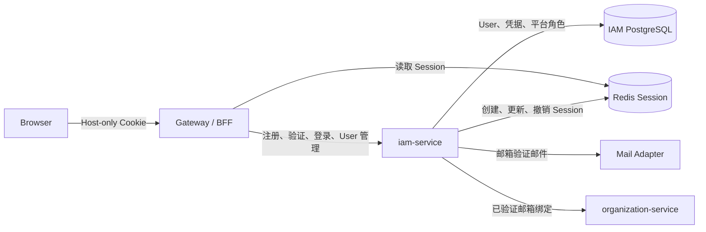
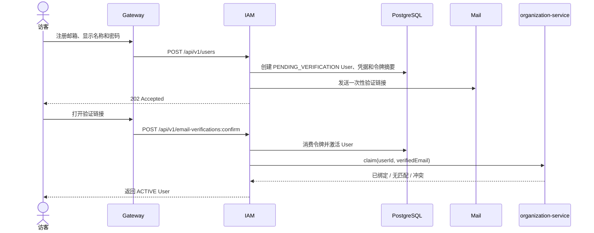
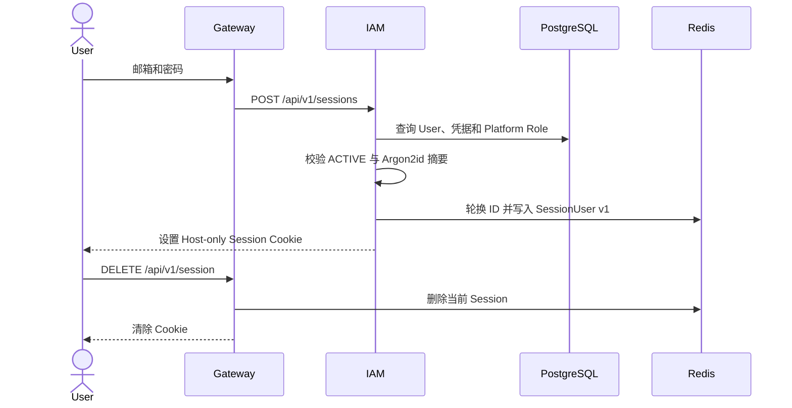
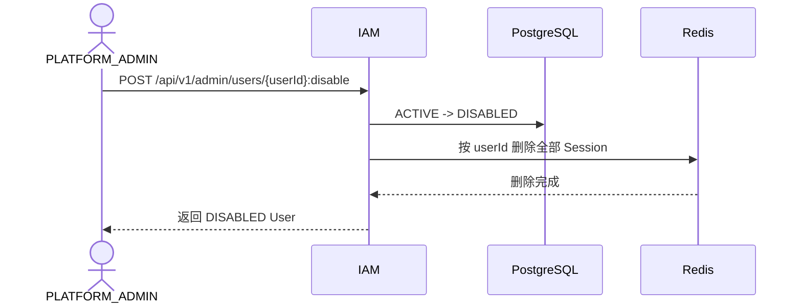
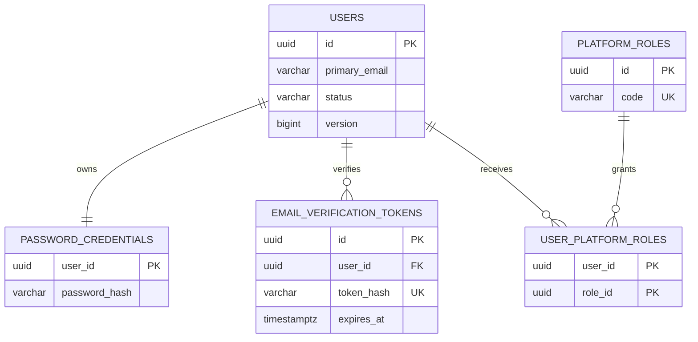
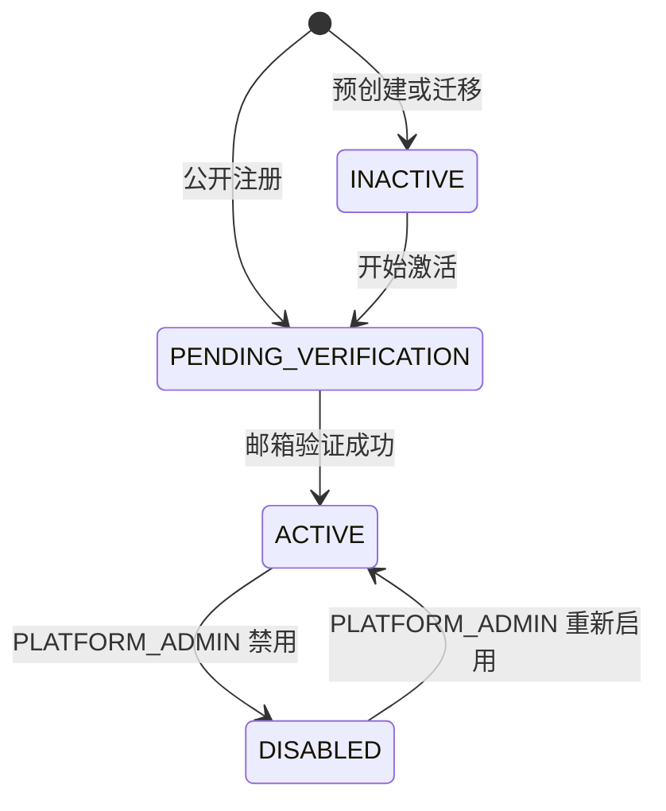

# 用户与身份-技术设计与开发手册

| 项目 | 内容 |
| --- | --- |
| 状态 | 已确认 |
| 技术负责人 | 待指定 |
| 最后更新 | 2026-07-19 |
| 关联 PRD | [用户与身份-需求文档](../product/user-identity-prd.md) |
| 目标版本 | MVP |

## 1. 设计概述

### 1.1 设计目标

在现有 `iam-service` 中实现平台级 User 与身份认证能力，不新建 `user-service`。MVP 只支持主邮箱注册、邮箱验证、密码登录和当前 Session 登出。PostgreSQL 是 User、凭据、平台角色和一次性邮箱验证事实源；Redis 只保存服务端 Session。Gateway/BFF 解析 Host-only Session Cookie 并向下游传递可信、版本化的 User 上下文。

### 1.2 PRD 映射

| PRD 编号 | 技术实现位置 | 验证方式 |
| --- | --- | --- |
| FR-001、FR-002 | `IdentityModule`、注册和验证接口 | TC-001 至 TC-006 |
| FR-003、FR-004 | `AuthenticationModule`、Gateway Session Adapter | TC-007 至 TC-012 |
| FR-005、FR-006 | 当前 Session 和 User 资源接口 | TC-013 至 TC-016 |
| FR-007 至 FR-010 | `PlatformUserAdministration`、Session 索引 | TC-017 至 TC-022 |
| FR-011 | organization-service Employee 绑定接口 | TC-023 至 TC-025 |
| FR-012 | Flyway 和幂等 Seed Runner | TC-026 至 TC-029 |

### 1.3 技术范围与非目标

本次实现范围：

- `users`、密码凭据、邮箱验证、平台角色及角色分配表。
- 注册、邮箱验证、登录、登出、当前 User 资料和平台 User 管理接口。
- Redis Session、User Session 索引和版本化 `SessionUser` 快照。
- 邮件发送 Adapter 和 organization-service Employee 绑定调用。
- Flyway `db migrate` 与幂等 `db seed`。

本次技术非目标：

- 修改、重置或找回密码，以及修改主邮箱。
- 手机号或第三方身份认证。
- OAuth/OIDC Authorization Server、JWT 和访问令牌。
- Tenant 内 Employee、External Contact、Tenant Role 或业务资源授权。
- PostgreSQL Session 表、User 数据缓存和跨服务共享 JPA Entity。

### 1.4 技术约束与设计原则

1. **接口向后兼容**：接口、参数及响应字段只能兼容扩展；破坏性变更必须升级版本并提供迁移期。
2. **数据库结构安全演进**：表和字段使用 `snake_case`；不得直接删除字段或改变已有字段语义，破坏性变更必须经过兼容迁移。
3. **User 资源统一**：所有 User 接口返回同一标准资源结构；凭据、Session、令牌和租户对象不得嵌入 User。
4. **领域归属明确**：User、密码凭据、平台角色和全局状态归 `iam-service`；Employee 和 Tenant Role 不归 IAM。
5. **数据单一写入方**：只有 IAM 可以写 User 与凭据表；其他服务通过可信上下文或内部接口协作。
6. **需求与测试可追踪**：接口和测试引用对应的 `FR`、`BR` 和 `AC`。
7. **Session 不表达租户授权**：Session 可以携带 Platform Role，但不携带 Tenant Role、Employee 状态或业务权限。

## 2. 系统架构与职责

### 2.1 领域与服务归属

- 归属结论：在现有 `iam-service` 的 `identity`、`authorization` 和 `protocol` 包内迭代，不创建新服务。
- 判断依据：User、密码认证、平台角色和 Session 创建共享一致的全局身份边界；拆分服务不会形成独立业务能力，反而增加登录链路故障点。
- `identity` 保持框架无关，协议、Web、持久化、Redis、邮件和 HTTP Client 位于 Adapter。

### 2.2 系统架构图



### 2.3 服务职责

| 服务或组件 | 负责 | 不负责 | 拥有的数据 | 调用方或依赖 |
| --- | --- | --- | --- | --- |
| Gateway/BFF | Session Cookie、CSRF、Session 解析、可信 User 上下文和路由 | User 凭据、Tenant 访问判断 | 无领域数据；读取 Redis Session | Browser、IAM、领域服务 |
| iam-service | User、密码认证、邮箱验证、Platform Role、Session 生命周期 | Employee、Tenant Role、业务权限 | IAM PostgreSQL、Redis Session 写入 | Gateway、Mail、organization-service |
| organization-service | Employee 和 External Contact 与 User 的 Tenant 内关联 | User 密码、Session 和平台状态 | Organization PostgreSQL | IAM 绑定调用、Gateway 用户请求 |
| Mail Adapter | 发送验证邮件 | 验证 User 或修改 User 状态 | 无 | IAM、SMTP 服务 |

### 2.4 模块与接口边界

| 提供方 | 模块或接口 | 调用方 | 职责 | 关键约束 |
| --- | --- | --- | --- | --- |
| IAM | `IdentityModule` | Web、管理和验证 Adapter | 注册、验证、查询和更新 User 状态 | 不依赖 Spring、JPA 或 Redis |
| IAM | `PasswordAuthentication` | Login Adapter、Seed Runner | 创建密码摘要和验证密码 | 只处理摘要，不返回明文 |
| IAM | `PlatformUserAdministration` | 管理接口 | 查询、禁用、启用和 Platform Role | 仅 PLATFORM_ADMIN |
| IAM | `SessionLifecycle` | Login、Logout、User 更新和禁用流程 | 创建、同步和撤销 Session | 使用 `userId -> sessionId[]` 索引 |
| IAM | `EmployeeBindingClient` | 邮箱验证流程 | 请求 organization-service 绑定 Employee | 失败不回滚 User 激活 |

## 3. 核心流程

### 3.1 流程清单

| 流程 | 参与方 | 触发条件 | 对应需求 |
| --- | --- | --- | --- |
| 注册与邮箱验证 | Browser、Gateway、IAM、PostgreSQL、Mail、Organization | 新邮箱注册 | FR-001、FR-002、FR-011 |
| 密码登录 | Browser、Gateway、IAM、PostgreSQL、Redis | ACTIVE User 提交凭据 | FR-003、FR-004 |
| 当前 Session 登出 | Browser、Gateway、Redis | 已登录 User 登出 | FR-005 |
| User 禁用 | PLATFORM_ADMIN、IAM、PostgreSQL、Redis | 平台治理操作 | FR-008、FR-010 |
| User 资料同步 | User、IAM、PostgreSQL、Redis | User 更新资料 | FR-006、FR-009 |

### 3.2 注册与邮箱验证时序



- User、凭据和验证令牌在一个 PostgreSQL 本地事务中创建。
- 验证令牌使用加密安全随机值，数据库只保存 SHA-256 摘要；默认 30 分钟有效且只能消费一次。
- User 激活事务先提交，再调用 organization-service。绑定失败记录结构化结果，不撤销已验证身份。

### 3.3 密码登录与登出时序



- 不存在邮箱、错误密码使用同一外部错误；密码校验路径避免明显时序差异。
- 登录成功后必须轮换 Session ID，防止 Session Fixation。
- 登出只删除当前 Session。User 全局禁用才删除该 User 的全部 Session。

### 3.4 User 禁用时序



- 登录事务读取 User 时持有与状态更新互斥的行锁，直到 Session 创建完成；禁用事务锁定 User、暂存 `DISABLED` 状态、删除全部 Redis Session，并且只在撤销成功后提交。Redis 撤销失败时回滚 User 状态并触发告警，避免登录和禁用交错产生漏删 Session。
- 新登录始终从 PostgreSQL读取 User 状态，因此 `DISABLED` User 不能创建新 Session。
- 重新启用只修改为 `ACTIVE`，不恢复旧 Session。

## 4. 认证、授权与租户隔离

### 4.1 身份与 Session 上下文

- 注册、邮箱验证和登录接口允许匿名访问；User 自身和平台管理接口使用 Session。
- Gateway 从 Host-only Cookie 读取 Session ID，并从 Redis 解析 `SessionUser v1`。
- Gateway 删除任何客户端伪造的内部 User Header，再生成可信 User 上下文。
- IAM 创建、更新和删除 Session；Gateway 读取 Session 并维护访问时间。
- User 资料或 Platform Role 变化后，IAM 按 `userId` 索引同步更新其全部 Session 快照。
- User 被禁用后 IAM 按 `userId` 索引删除全部 Session；下一次请求返回 `401`。
- 全局 User 接口不接受 `tenant_id`。访问 Tenant 资源时由目标领域服务校验 Employee 或 External Contact。
- 内部 Employee 绑定调用不传 Browser Cookie；MVP 依赖私有网络互信，不使用 Service Token。

`SessionUser v1`：

```text
version
userId
primaryEmail
primaryEmailVerifiedAt
displayName
avatarUrl
locale
timeZone
status
platformRoles[]
userVersion
```

Session 不包含密码摘要、邮箱验证令牌、Tenant ID、Employee、Tenant Role 或业务权限。

### 4.2 权限矩阵

| 接口或资源 | 用户类型或角色 | 可访问范围 | 校验服务 | 失败响应 |
| --- | --- | --- | --- | --- |
| 注册、邮箱验证、登录 | 匿名 | 仅提交本次身份操作 | IAM | 400 / 409 / 429 |
| 当前 User | ACTIVE User | 自己的 User 资源 | Gateway + IAM | 401 |
| 当前 Session 登出 | 已登录 User | 当前 Session | Gateway | 204，重复调用仍成功 |
| 平台 User 查询 | PLATFORM_ADMIN | 全局 User 基础资料 | IAM | 401 / 403 |
| User 禁用和启用 | PLATFORM_ADMIN | 非受保护目标 User | IAM | 401 / 403 / 409 |

首个平台管理员不能禁用自己，且系统不得删除最后一个有效 PLATFORM_ADMIN 的角色或禁用其 User，避免平台失去管理入口。

## 5. 数据模型

### 5.1 领域对象与数据关系图





### 5.2 标准 User 资源对象

| JSON 字段 | 类型 | 必有 | 说明 | 加载方式 |
| --- | --- | --- | --- | --- |
| `id` | UUID | 是 | 永久全局 User ID | 默认 |
| `primaryEmail` | String | 是 | 当前主邮箱 | 默认；仅本人、平台管理员和可信内部上下文可见 |
| `primaryEmailVerifiedAt` | Instant | 否 | 邮箱验证时间 | 默认 |
| `displayName` | String | 是 | 平台级显示名称 | 默认 |
| `avatarUrl` | String | 否 | 平台级头像 URL | 默认 |
| `locale` | String | 否 | BCP 47 语言标签 | 默认 |
| `timeZone` | String | 否 | IANA 时区 | 默认 |
| `status` | Enum | 是 | User 生命周期状态 | 默认 |
| `platformRoles` | Array | 否 | 平台角色代码 | `include=platformRoles`；Session 默认加载 |
| `createdAt` | Instant | 是 | 创建时间 | 默认 |
| `updatedAt` | Instant | 是 | 更新时间 | 默认 |

`primaryEmailNormalized`、密码凭据、Session 和验证令牌不是 User 资源字段。

### 5.3 表结构

#### `users`

| 字段 | 类型 | 可空 | 默认值 | 约束 | 说明 |
| --- | --- | --- | --- | --- | --- |
| `id` | `uuid` | 否 | 应用生成 | PK | 永久 User ID |
| `primary_email` | `varchar(320)` | 否 |  |  | 原始规范化前展示值 |
| `primary_email_normalized` | `varchar(320)` | 否 |  | UNIQUE | `trim + lower-case` 登录键 |
| `primary_email_verified_at` | `timestamptz` | 是 |  |  | 验证成功时间 |
| `display_name` | `varchar(128)` | 否 |  | CHECK 非空 | 平台显示名称 |
| `avatar_url` | `varchar(2048)` | 是 |  |  | HTTPS 头像 URL |
| `locale` | `varchar(35)` | 是 |  |  | BCP 47 |
| `time_zone` | `varchar(64)` | 是 |  |  | IANA Zone ID |
| `status` | `varchar(32)` | 否 |  | CHECK | 四种合法状态 |
| `version` | `bigint` | 否 | `0` |  | 乐观锁及 Session 版本 |
| `created_at` | `timestamptz` | 否 |  |  | 创建时间 |
| `updated_at` | `timestamptz` | 否 |  |  | 更新时间 |

- 唯一索引：`users(primary_email_normalized)`。
- 管理查询索引：`users(status, created_at desc)`。
- User 不属于 Tenant，因此本表没有 `tenant_id` 和 RLS Tenant 策略。
- 不提供软删除或物理删除字段。

#### `password_credentials`

| 字段 | 类型 | 可空 | 默认值 | 约束 | 说明 |
| --- | --- | --- | --- | --- | --- |
| `user_id` | `uuid` | 否 |  | PK、FK users | 一个 User 一份密码凭据 |
| `password_hash` | `varchar(255)` | 否 |  |  | Argon2id 编码结果 |
| `created_at` | `timestamptz` | 否 |  |  | 创建时间 |
| `updated_at` | `timestamptz` | 否 |  |  | 预留后续安全升级 |

- 不保存明文、可逆密文或独立盐字段；编码结果包含算法和参数。
- 密码长度为 12 至 128 个 Unicode 字符；拒绝空白密码和超过上限的输入。

#### `email_verification_tokens`

| 字段 | 类型 | 可空 | 默认值 | 约束 | 说明 |
| --- | --- | --- | --- | --- | --- |
| `id` | `uuid` | 否 | 应用生成 | PK | 内部记录 ID |
| `user_id` | `uuid` | 否 |  | FK users | 目标 User |
| `token_hash` | `char(64)` | 否 |  | UNIQUE | SHA-256 十六进制摘要 |
| `expires_at` | `timestamptz` | 否 |  |  | 默认 30 分钟 |
| `consumed_at` | `timestamptz` | 是 |  |  | 一次性消费时间 |
| `created_at` | `timestamptz` | 否 |  |  | 创建时间 |

- 索引：`email_verification_tokens(user_id, created_at desc)`。
- 该令牌只允许激活一个待验证 User，不是访问令牌，不能调用其他资源接口。
- 创建新令牌时使同 User 的未消费旧令牌失效。

#### `platform_roles`

| 字段 | 类型 | 可空 | 默认值 | 约束 | 说明 |
| --- | --- | --- | --- | --- | --- |
| `id` | `uuid` | 否 | 应用生成 | PK | Role ID |
| `code` | `varchar(64)` | 否 |  | UNIQUE | MVP 为 `PLATFORM_ADMIN` |
| `name` | `varchar(128)` | 否 |  |  | 展示名称 |
| `built_in` | `boolean` | 否 | `true` |  | 内置角色不能删除 |
| `created_at` | `timestamptz` | 否 |  |  | 创建时间 |

#### `user_platform_roles`

| 字段 | 类型 | 可空 | 默认值 | 约束 | 说明 |
| --- | --- | --- | --- | --- | --- |
| `user_id` | `uuid` | 否 |  | PK、FK users | User |
| `role_id` | `uuid` | 否 |  | PK、FK platform_roles | Platform Role |
| `granted_by_user_id` | `uuid` | 是 |  | FK users | Seed 时为空 |
| `granted_at` | `timestamptz` | 否 |  |  | 授予时间 |

### 5.4 状态、并发与迁移

- 注册按 `primary_email_normalized` 唯一约束处理并发；唯一冲突转换为统一注册响应，不暴露数据库异常。
- 邮箱验证在事务内锁定令牌和 User，重复消费返回幂等结果或明确失效错误，不重复触发状态变化。
- User 更新使用 `version` 乐观锁；提交成功后将新版本同步到全部 Session。
- 禁用和启用使用条件更新，非法状态转换返回 `USER_STATUS_CONFLICT`。
- `db migrate` 只执行 Flyway 版本迁移，不初始化角色或用户。
- `db seed` 在迁移完成后执行，先按角色代码确保 `PLATFORM_ADMIN` 存在；已有平台管理员时不创建或修改 User，没有平台管理员时才按配置邮箱创建或授予初始管理员。
- Seed 邮箱和初始密码来自部署 Secret。不存在配置邮箱对应的 User 时，Seed 创建已验证的 ACTIVE User；已存在 ACTIVE User 时只授予角色；已存在非 ACTIVE User 时安全失败，不覆盖其资料、状态或密码。相同配置重复运行结果不变。

## 6. 接口与集成设计

### 6.1 接口通用约定

- Java 和 JSON 使用 `camelCase`；PostgreSQL 使用 `snake_case`。
- Browser 只持有 Host-only Session Cookie，不持有访问令牌。
- Cookie 使用 `Secure`、`HttpOnly`、`SameSite=Lax`，生产环境只通过 HTTPS 传输。
- 写请求使用同步 Token 或 Cookie-to-header CSRF 防护。
- 登录、注册和邮箱验证接口按来源 IP 与规范化邮箱执行有界频率限制；限制状态可放 Redis，但不是领域事实。
- 时间使用 ISO-8601 UTC，时区使用 IANA Zone ID，语言使用 BCP 47。
- 错误体统一包含 `code`、`message`、`correlationId`，不得返回密码、令牌、Session ID 或堆栈。

### 6.2 接口清单

| 编号 | 类型 | 方法与路径 | 调用方 | 权限 | 对应需求 |
| --- | --- | --- | --- | --- | --- |
| API-001 | 用户接口 | `POST /api/v1/users` | 匿名 Browser | 公开、限流 | FR-001 |
| API-002 | 用户接口 | `POST /api/v1/email-verifications:confirm` | 匿名 Browser | 一次性验证令牌 | FR-002 |
| API-003 | 用户接口 | `POST /api/v1/sessions` | 匿名 Browser | 公开、限流 | FR-003、FR-004 |
| API-004 | 用户接口 | `DELETE /api/v1/session` | Browser | 当前 Session | FR-005 |
| API-005 | 用户接口 | `GET /api/v1/user` | Browser | ACTIVE User | FR-006 |
| API-006 | 用户接口 | `PATCH /api/v1/user` | Browser | ACTIVE User | FR-006、FR-009 |
| API-007 | 管理接口 | `GET /api/v1/admin/users` | Browser | PLATFORM_ADMIN | FR-007 |
| API-008 | 管理接口 | `GET /api/v1/admin/users/{userId}` | Browser | PLATFORM_ADMIN | FR-007 |
| API-009 | 管理接口 | `POST /api/v1/admin/users/{userId}:disable` | Browser | PLATFORM_ADMIN | FR-008、FR-010 |
| API-010 | 管理接口 | `POST /api/v1/admin/users/{userId}:enable` | Browser | PLATFORM_ADMIN | FR-008、FR-010 |

所有用户接口从 Session 识别 `userId`，不得接受客户端提交的 `userId`。平台管理接口的路径 ID 是管理目标，不是当前 User 身份。

### 6.3 接口详细设计

#### API-001 注册 User

- 方法与路径：`POST /api/v1/users`
- 请求：`primaryEmail`、`displayName`、`password`
- 响应：统一 `202 Accepted`，不通过响应泄露邮箱是否已经注册。
- 行为：新邮箱创建 User、凭据和验证令牌并发送邮件；已有 ACTIVE 或 DISABLED User 不创建数据也不发送邮件；已有 PENDING_VERIFICATION User 不修改凭据或资料，只使旧令牌失效并重发验证邮件。
- 错误：`400 INVALID_REGISTRATION`、`429 REGISTRATION_RATE_LIMITED`。

#### API-002 确认邮箱验证

- 方法与路径：`POST /api/v1/email-verifications:confirm`
- 请求：`token`
- 响应：标准 User 资源。
- 错误：`400 VERIFICATION_TOKEN_INVALID`、`410 VERIFICATION_TOKEN_EXPIRED`、`409 USER_STATUS_CONFLICT`。
- 成功后异步或事务后调用 organization-service；绑定结果不改变本接口成功语义。

#### API-003 创建 Session

- 方法与路径：`POST /api/v1/sessions`
- 请求：`primaryEmail`、`password`
- 响应：`204 No Content` 并设置 Session Cookie。
- 错误：`401 INVALID_CREDENTIALS`、`403 EMAIL_VERIFICATION_REQUIRED`、`403 USER_DISABLED`、`429 LOGIN_RATE_LIMITED`。
- 只有密码正确后才返回待验证或禁用状态，避免任意邮箱枚举。

#### API-004 删除当前 Session

- 方法与路径：`DELETE /api/v1/session`
- 响应：`204 No Content`，重复请求幂等。
- 行为：删除当前 Redis Session 并清除 Cookie，不影响其他 Session。

#### API-005/006 当前 User

- `GET /api/v1/user` 返回标准 User 资源，默认不展开 `platformRoles`。
- `PATCH /api/v1/user` 只接受 `displayName`、`avatarUrl`、`locale` 和 `timeZone`。
- 更新使用 `If-Match` 或资源 `version` 防止丢失更新；成功后同步全部 Session 快照。
- `primaryEmail`、状态、平台角色和凭据不能通过该接口修改。

#### API-007/008 平台 User 查询

- 支持 `page`、`size`、`status` 和 `primaryEmail` 精确筛选；默认按 `createdAt desc`。
- 列表返回标准 User 摘要，详情可以 `include=platformRoles`。
- 邮箱仅对 PLATFORM_ADMIN 可见，日志不得记录完整查询邮箱。

#### API-009/010 禁用和启用 User

- 禁用请求可携带不超过 500 字符的审计原因，但不进入 User 标准资源。
- 禁止当前管理员禁用自己，禁止禁用最后一个有效 PLATFORM_ADMIN。
- 禁用成功前必须完成全部 Session 撤销；启用不创建 Session。
- 错误：`404 USER_NOT_FOUND`、`409 USER_STATUS_CONFLICT`、`409 LAST_PLATFORM_ADMIN_REQUIRED`。

### 6.4 其他集成

#### Employee 邮箱绑定

IAM 在邮箱验证成功后调用：

```text
POST /internal/v1/employee-bindings:claim
userId
verifiedEmail
```

- organization-service 只绑定精确、活动、尚未绑定且 Tenant 内唯一的 Employee。
- 响应只返回绑定引用和结果类型，不返回通讯录名片。
- 无匹配、重复匹配或已有绑定记录为诊断结果，不回滚 User 激活。
- 内部调用不传 Cookie；MVP 依赖私有网络互信。

#### `db migrate` 与 `db seed`

- `db migrate`：调用 Flyway 校验并应用未执行的版本迁移。
- `db seed`：要求数据库已经迁移到当前版本，在单个事务中初始化内置角色，并且只在不存在任何平台管理员时初始化首个管理员、凭据和角色关系。
- 必需部署配置：初始平台管理员邮箱和密码；密码只在首次创建凭据时读取并立即哈希。
- 相同配置重复运行结果不变；已存在平台管理员时忽略初始管理员配置，不覆盖任何 User、状态或密码。不存在平台管理员但配置邮箱已属于非 ACTIVE User 时安全失败并要求人工处理。

## 7. 测试用例与验收标准

### 7.1 需求覆盖矩阵

| PRD 编号 | 实现模块或接口 | 测试用例 |
| --- | --- | --- |
| FR-001、FR-002 | API-001、API-002 | TC-001 至 TC-006 |
| FR-003、FR-004 | API-003、Session Adapter | TC-007 至 TC-012 |
| FR-005、FR-006 | API-004 至 API-006 | TC-013 至 TC-016 |
| FR-007 至 FR-010 | API-007 至 API-010 | TC-017 至 TC-022 |
| FR-011 | Employee Binding Client | TC-023 至 TC-025 |
| FR-012 | Migration、Seed Runner | TC-026 至 TC-029 |

### 7.2 测试用例

| 编号 | 层级 | 场景 | 前置条件 | 操作 | 预期结果 |
| --- | --- | --- | --- | --- | --- |
| TC-001 | 模块 | 新邮箱注册 | 邮箱不存在 | 并发提交两次注册 | 只创建一个 User 和凭据 |
| TC-002 | API | 注册响应防枚举 | 邮箱分别不存在和已存在 | 提交相同形态请求 | 外部响应语义一致 |
| TC-003 | 模块 | 未验证 User | User 为 PENDING | 尝试登录 | 不建立 Session |
| TC-004 | 模块 | 有效邮箱验证 | Token 有效 | 确认 Token | User 变为 ACTIVE，Token 被消费 |
| TC-005 | 模块 | 重复验证 | Token 已消费 | 再次确认 | 不重复改变状态或触发绑定 |
| TC-006 | 模块 | 过期验证 | Token 已过期 | 确认 Token | 返回过期错误，User 不变 |
| TC-007 | API | 正确凭据登录 | ACTIVE User | 提交正确邮箱密码 | 轮换 ID 并建立 Session |
| TC-008 | API | 不存在邮箱 | 无 User | 尝试登录 | 与错误密码相同的 401 |
| TC-009 | API | 错误密码 | ACTIVE User | 提交错误密码 | 401，不建立 Session |
| TC-010 | API | 禁用 User 登录 | DISABLED User | 提交正确密码 | 403，不建立 Session |
| TC-011 | 安全 | Session Fixation | 请求携带预设 Session ID | 登录成功 | 使用新的 Session ID |
| TC-012 | 安全 | 登录频率限制 | 连续失败超过阈值 | 再次登录 | 429，不执行昂贵查询洪泛 |
| TC-013 | API | 当前 Session 登出 | 有效 Session | 登出后再次请求 | 登出 204，后续请求 401 |
| TC-014 | API | 重复登出 | Session 已删除 | 再次登出 | 仍返回 204 |
| TC-015 | API | User 更新资料 | ACTIVE User | 更新允许字段 | User 和全部 Session 快照更新 |
| TC-016 | API | User 越权更新 | ACTIVE User | 提交邮箱、状态或角色 | 返回 400/403，数据不变 |
| TC-017 | API | 平台 User 查询 | PLATFORM_ADMIN | 分页和筛选 | 结果正确且不包含凭据 |
| TC-018 | 安全 | 普通 User 调用管理接口 | 无 Platform Role | 查询或禁用 User | 返回 403 |
| TC-019 | 集成 | 禁用 User | 目标有多个 Session | 管理员禁用 | 全部 Session 删除，后续请求 401 |
| TC-020 | 集成 | 重新启用 User | 目标为 DISABLED | 管理员启用 | 状态 ACTIVE，旧 Session 不恢复 |
| TC-021 | 业务 | 管理员禁用自己 | 当前 User 为管理员 | 禁用自身 | 返回冲突，状态不变 |
| TC-022 | 业务 | 最后一个平台管理员保护 | 仅一个有效管理员 | 禁用或移除角色 | 返回冲突 |
| TC-023 | 集成 | Employee 唯一匹配 | 已验证邮箱唯一匹配 | User 激活 | Employee 成功绑定 |
| TC-024 | 集成 | Employee 无匹配 | 无匹配 | User 激活 | User 保持 ACTIVE，记录无匹配 |
| TC-025 | 集成 | Employee 绑定冲突 | 重复或已绑定 | User 激活 | User 保持 ACTIVE，不泄露名片 |
| TC-026 | 迁移 | 空库迁移 | 新 PostgreSQL | 执行 db migrate | 全部表、索引和约束正确 |
| TC-027 | 迁移 | 重复迁移 | 已是当前版本 | 再次执行 | 无结构变化或错误 |
| TC-028 | 集成 | 首次 Seed | 空业务表且配置有效 | 执行 db seed | 创建一个管理员和角色分配 |
| TC-029 | 集成 | 重复 Seed | Seed 已完成 | 重复执行 | 无重复数据，不覆盖资料、状态或密码 |

### 7.3 必测范围

- 邮箱规范化、唯一约束、一次性验证及并发注册。
- 密码摘要、统一登录失败、频率限制和 Session Fixation。
- Session 创建、同步、当前登出和全局撤销。
- Platform Role 越权、管理员自我保护和最后管理员保护。
- User 与 Employee 边界，以及绑定失败不影响 User 激活。
- Flyway 前向迁移、约束、索引和幂等 Seed。
- Cookie、CSRF、伪造可信 Header 和敏感信息日志检查。

### 7.4 完成要求

- 所有 P0 功能需求都有自动化测试。
- PRD 的全部验收标准都有对应测试覆盖。
- User 标准资源在所有接口中的字段、类型和语义一致。
- 数据库迁移和 Seed 可在空库及已初始化数据库安全执行。
- User 禁用后旧 Session 不再可用。
- 架构图、数据模型、接口契约和最终实现保持一致。

测试执行状态和结果由自动化测试、关联 Issue 或 Pull Request 记录，不在本文档中维护勾选状态。
