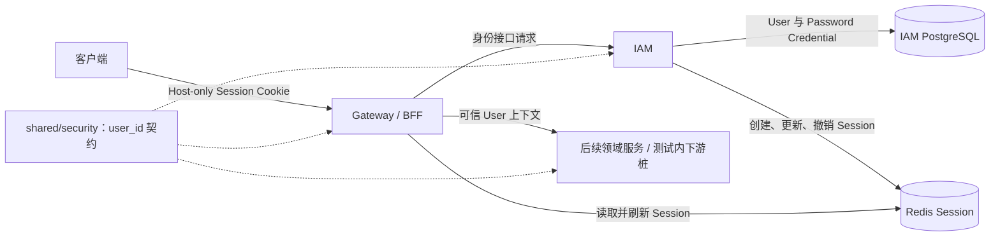
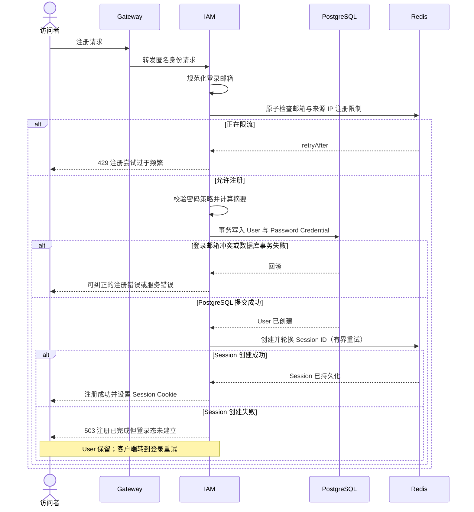
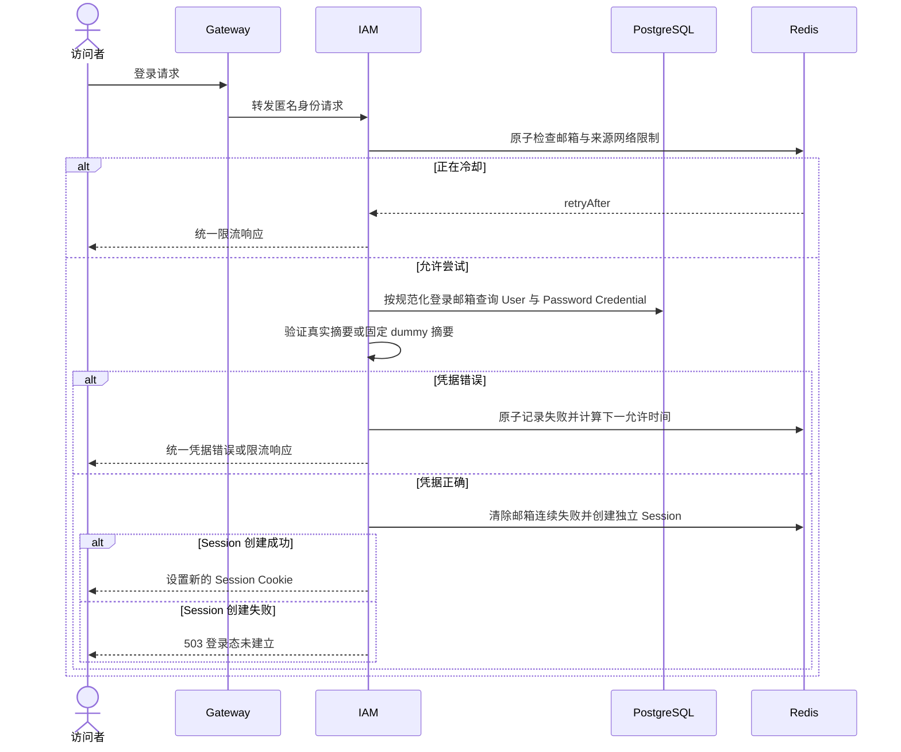
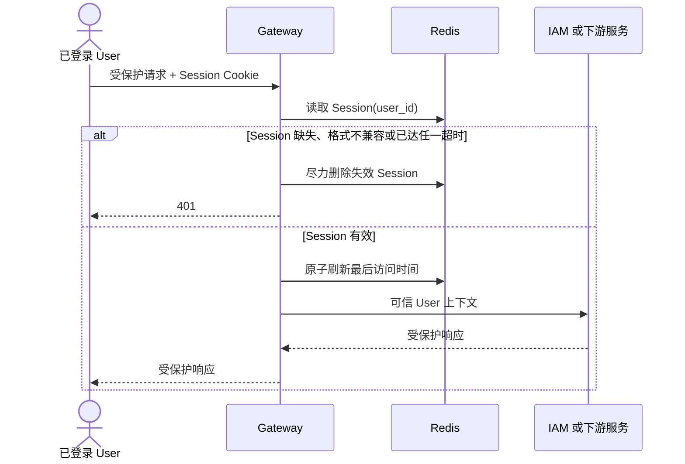
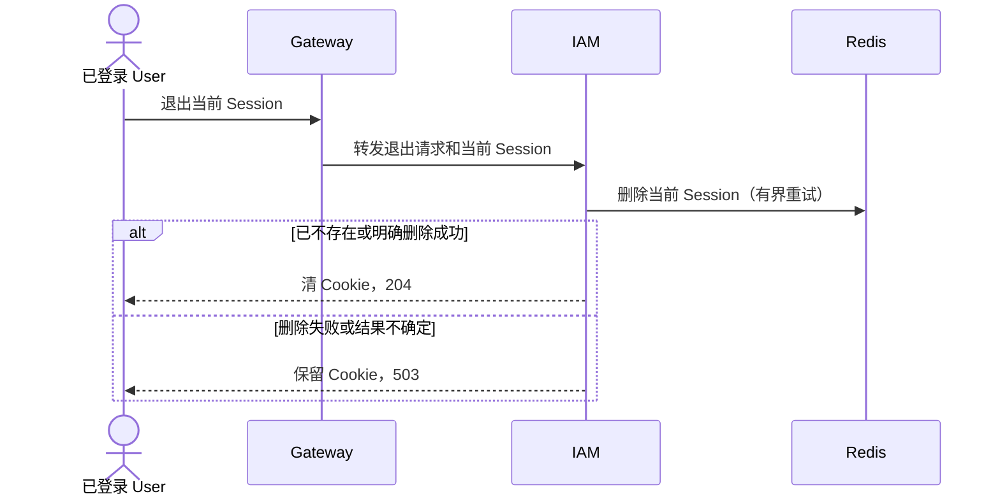
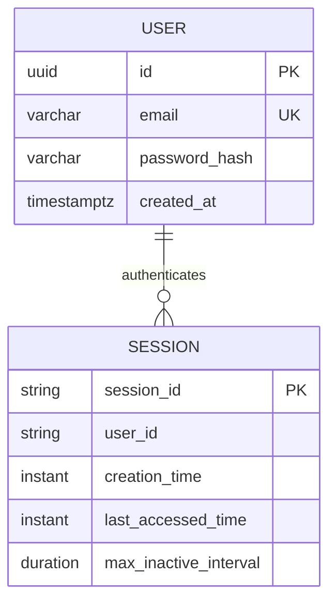

# 用户与身份技术设计与开发手册

| 项目 | 内容 |
| --- | --- |
| 状态 | 已批准 |
| 技术负责人 | 待指定 |
| 最后更新 | 2026-07-20 |
| 关联 PRD | [用户与身份需求文档](../product/user-identity-prd.md) |
| 目标版本 | MVP |

## 1. 设计概述

### 1.1 设计目标

在现有 IAM 服务内交付全局 User、Password Credential、注册、登录、当前用户信息、当前设备退出、登录失败限制和服务器端 Session。Gateway 与 `shared/security` 同步建立只含 `user_id` 的 Session 安全执行缝，使同一登录状态既能保护 IAM 当前用户接口，也能作为后续领域服务可信识别 User 的基础；Session 只证明全局 User 身份，不表达 Tenant、Employee、角色或业务资源权限。

### 1.2 PRD 映射

| PRD 编号 | 技术实现责任 | 验证方式 |
| --- | --- | --- |
| `FR-001` 至 `FR-005`、`BR-002` 至 `BR-005` | IAM `identity` 与 `protocol`：注册、Password Credential、密码策略和密码登录 | `AC-001` 至 `AC-004`、`AC-011`；测试缝在第 7 章确认 |
| `FR-006`、`FR-007`、`BR-006` | IAM、Redis 与 Gateway：多设备独立 Session、空闲和绝对超时 | `AC-008`、`AC-009`；测试缝在第 7 章确认 |
| `FR-008` 至 `FR-010`、`BR-001`、`BR-007`、`BR-008` | IAM 当前用户与退出能力；Gateway 和 `shared/security` 的可信 `user_id` 执行缝 | `AC-006`、`AC-007`、`AC-010`；测试缝在第 7 章确认 |
| `FR-011`、`BR-009`、`BR-010` | IAM 统一认证失败与临时失败限制 | `AC-004`、`AC-005`；测试缝在第 7 章确认 |
| `FR-012` | IAM/Gateway HTTP 接口，不交付产品 UI | `AC-012` |

`FR-009 / AC-007` 不新增演示型公开接口：当前用户信息接口是首个真实受保护行为；Gateway 使用测试内下游桩验证有效 Session 能建立可信 User 上下文、无效 Session 返回 `401`。

### 1.3 技术范围与非目标

本次实现范围：

- IAM 内框架无关的 User、Password Credential 和认证策略领域能力。
- IAM 的注册、密码登录、当前用户信息和当前设备退出 HTTP 能力。
- 全局忽略大小写的登录邮箱唯一性、密码长度策略和临时失败限制。
- Redis 服务器端 Session、多设备独立登录、12 小时空闲超时和 7 天绝对超时。
- Gateway 的最小 Session 验证、CSRF、客户端身份头清理和可信 `user_id` 上下文。
- `shared/security` 的 Session 身份安全接口，并移除与目标架构冲突的 Tenant JWT 运行缝。
- 移除 IAM 当前未使用且与产品非目标冲突的 OAuth2 Authorization Server starter、issuer 配置和自动配置端点。
- PostgreSQL 兼容性迁移、必要的运行配置、可观测性和覆盖全部验收标准的自动化测试。

本次技术非目标：

- 邮箱验证，或把登录邮箱作为可信联系方式、Primary Email 或 Employee 自动绑定依据。
- 忘记、重置或修改密码，以及修改登录邮箱、昵称或其他资料。
- User 注销、停用、管理、平台角色、Tenant Role 或差异化权限。
- Tenant、Employee、External Contact、Collaborator 和业务资源授权。
- 用户名、手机号、第三方身份、无密码登录、OAuth/OIDC Authorization Server、JWT 或访问令牌。
- Remember Me、全部设备退出、登录设备管理及产品 UI。
- organization-service 或其他业务领域服务的实现。

### 1.4 技术约束与设计原则

以下规则默认适用于所有技术设计。任何例外都必须在本节说明原因、影响和迁移方案。

1. **接口向后兼容**：不得随意删除、重命名接口，或修改已有请求参数、响应字段的名称、类型及业务语义。新增能力优先采用兼容性扩展；破坏性变更必须通过版本升级、废弃周期和调用方迁移方案实施。
2. **数据库结构安全演进**：不得随意删除表、删除字段，或直接修改已有字段的数据类型及业务语义。数据库变更优先采用新增表、字段或索引等兼容性迁移；破坏性变更必须经过数据迁移、兼容运行、结果校验和回滚设计。
3. **领域资源对象保持统一**：每个领域资源必须定义唯一、稳定的标准响应结构。同一资源在不同接口中的字段名称、类型和语义必须一致。关联对象默认不加载，并通过 `include`、`expand` 等明确机制按需加载。创建、更新和查询条件等请求对象可以按业务场景单独定义。
4. **明确领域归属与服务边界**：设计开始前必须明确本次能力是在现有领域服务内迭代，还是创建新的领域服务。判断依据包括数据所有权、业务不变量、事务边界和领域职责，不能仅因新增数据表或 CRUD 接口而拆分服务。
5. **数据由所属领域服务写入**：每类核心数据必须有且只有一个权威领域服务。其他服务不得直接修改该服务拥有的数据表，只能通过接口或事件协作。
6. **需求、实现与测试可追踪**：技术模块、接口和测试用例应引用对应的 `FR`、`BR` 或 `AC` 编号，确保每项需求都有实现位置和验证方式。
7. **身份与租户上下文可信**：用户身份必须来自已验证的 Session。请求携带的 `tenant_id` 只能用于指定访问范围，服务仍必须验证用户与租户的有效关系，不得直接信任客户端声明。

补充本需求特有的现状、兼容性要求或基础设施约束：

- 当前 IAM 只有依赖和 `identity`、`tenancy`、`authorization`、`protocol` 包边界，没有 User 数据、迁移或身份接口，因此不存在需要兼容的既有 User API 或生产数据。
- Gateway 现有 `/iam/**` 骨架路由尚无已发布调用方；本次按确认的统一规范替换为 `/api/v1/iam/**`，同时保留 IAM/Gateway 默认端口和既有 Gradle/ArchUnit 模块边界。
- IAM 是 User、Password Credential 和 Session 生命周期的权威领域；Gateway 不拥有身份数据，`shared/security` 不拥有业务状态。
- `CONTEXT.md` 中 User、Login Email、Password Credential 与 Session 的定义是统一语言；Session 不得携带或推导 Tenant、Employee、角色和业务权限。
- `organization-service` 技术设计属于过早设计，不在本次同步修改；其中与 User、Session 或身份接口冲突的内容不构成本次约束，以本设计为准，未来启动通讯录开发前重新评审。
- 被删除的旧用户身份技术设计包含邮箱验证、资料、平台角色和 User 管理等已被当前 PRD 排除的能力，不作为本设计输入。

### 1.5 决策台账

#### 已确认

- 产品边界为 `FR-001` 至 `FR-012`、`BR-001` 至 `BR-010` 和 `AC-001` 至 `AC-012`。
- 本次交付归属现有 IAM；不创建新的 User 或 Authentication 服务。
- Gateway 与 `shared/security` 的最小 Session 身份改造属于本次范围。
- 登录邮箱首版不验证；Session 只证明全局 User 身份。
- 当前用户信息接口和 Gateway 测试内下游桩共同证明通用登录态鉴权，不新增公开演示接口。
- IAM 只向协议 Adapter 和行为测试暴露一个深的 `IdentityModule` 接口，完整处理注册并登录、密码登录、读取当前 User 和退出当前 Session。
- IAM 创建、更新和撤销 Redis Session；Gateway 直接读取同一 Session 命名空间并刷新访问时间。Session 业务属性和下游可信上下文都只携带 `user_id`，不设置显式版本号。
- 公开注册、登录、当前用户和退出 HTTP 契约由 IAM 直接拥有；Gateway 仅通过安全过滤与路由转发，不实现 BFF Controller 或复制身份接口语义。
- 注册事务提交 User 与密码摘要后才创建 Redis Session；Session 创建失败不补偿删除 User，有界重试仍失败时返回可恢复 `503`，后续通过登录建立 Session。
- 退出只有在 Session 已不存在或 Redis 明确删除成功时才清除 Cookie 并返回 `204`；删除失败或结果不确定时返回 `503`、保留 Cookie 以便重试，Gateway 对 Redis 故障失败关闭。
- 登录失败限制使用 Redis 双维度临时状态：规范化登录邮箱为主计数，来源网络为辅助计数；不写入 User 锁定状态，成功登录清除邮箱连续失败计数，已注册与未注册邮箱保持相同外部语义。
- 登录邮箱前 4 次连续失败只记录，第 5 次起依次冷却 30 秒、1、2、4、8、15 分钟并以 15 分钟封顶；1 小时无新失败自动清理。来源网络 10 分钟内允许 50 次失败，超出后冷却 10 分钟。
- 公开注册使用 Redis 双层令牌桶：规范化登录邮箱每小时 10 次，来源网络每分钟突发 5 次且每小时 20 次；在密码策略、摘要和数据库操作前执行，不引入 CAPTCHA 或全站注册硬上限。
- Gateway 对全部写请求使用 CSRF Cookie-to-Header 防护，包括匿名注册、匿名登录和退出；同时检查 Origin/Referer 与 Fetch Metadata，注册、登录或退出成功后清除旧 CSRF Token 并由客户端重新获取，不新增 CSRF Controller 或预登录 Session。
- Cookie 采用统一语义命名：Session 为 `cloudforge_session`，CSRF 为 `cloudforge_csrf_token`，客户端回传 Header 为 `X-CloudForge-CSRF`；两类 Cookie 都不设置 `Domain`，保持 Host-only。
- `cloudforge_session` 持久化 7 天，绝对期限从 Session 建立时固定计算且不随访问续期；Redis 12 小时空闲超时可以提前失效，退出成功将 Cookie 设为 `Max-Age=0`。
- Gateway 提供匿名 `GET /api/v1/iam/csrf` 安全引导端点，返回 `204`、`Cache-Control: no-store` 并设置 `cloudforge_csrf_token`；不创建 Redis Session，注册、登录或退出成功后客户端重新获取 Token。
- Password Credential 使用 Argon2id：`memory=19456 KiB`、`iterations=2`、`parallelism=1`、16 字节随机盐和 32 字节摘要；登录成功时按当前参数自动升级旧摘要，MVP 不使用 pepper。
- 产品负责人确认首版只执行密码长度规则，不检查常见或已泄露密码；`FR-005`、`BR-005` 和 `AC-003` 已同步收窄。
- 密码经 NFC 规范化后必须为 15 至 128 个 Unicode code point；允许空格，不修剪、不改变大小写、不截断，只拒绝控制字符，确认密码按相同规范化后的完整值比较。
- 生产流量经单一受信任 Ingress 进入 Gateway；Ingress 覆盖标准转发头，Gateway 使用 Spring Boot/Tomcat 原生能力解析真实客户端 IP，并以 `X-CloudForge-Client-IP` 传给 IAM 作为辅助限流键。
- `cloudforge_csrf_token` 是不设置 `Max-Age` 的浏览器 Session Cookie；首次启动、Cookie 缺失及注册、登录或退出成功后，客户端通过 `GET /api/v1/iam/csrf` 重新获取。
- 所有产品 API 使用 `/api/v1` 前缀：注册、登录、登出、CSRF 和 User Profile 分别为 `/api/v1/iam/auth/register`、`/api/v1/iam/auth/login`、`/api/v1/iam/auth/logout`、`/api/v1/iam/csrf` 和 `/api/v1/iam/user/profile`。
- 注册和登录成功都返回 `201 Created` 空响应体并设置新的 `cloudforge_session`；客户端进入首页后单独调用 User Profile 接口获取资源对象。
- 注册 JSON 为必填字符串 `email`、`password`、`confirmPassword`；登录 JSON 为必填字符串 `email`、`password`。两者要求 `application/json` 与 `X-CloudForge-CSRF`，未知字段忽略以保持兼容扩展。
- 公开与内部 HTTP 错误统一使用 RFC 9457 Problem Detail，并扩展领域前缀字符串 `code`、`traceId` 及按需的 `errors`；Gateway 透传 IAM 已形成的错误，只在连接、超时或非法响应时转换为明确的依赖错误。
- 有效 Session 下再次注册或登录返回 `409 IAM_ALREADY_AUTHENTICATED`，保留当前身份且不校验新凭据；切换 User 必须先退出，缺失或失效 Session 则按匿名请求处理。
- User Profile 成功返回 `200` 和直接资源对象，并使用 `Cache-Control: no-store`；无有效 Session 或 Session 指向不存在 User 时返回统一 `401 SECURITY_UNAUTHENTICATED`，后者同时删除异常 Session 并记录安全指标。
- 注册和登录采用已确认的稳定错误映射：校验 `400`、CSRF `403`、邮箱或已认证冲突 `409`、限流 `429`、依赖或 Session 建立失败 `503`；不存在邮箱与错误密码统一为 `401 IAM_INVALID_CREDENTIALS`。
- 登出使用 `POST /api/v1/iam/auth/logout`：Session 删除成功、未携带 Cookie 或 Redis 明确不存在时清除 Session/CSRF Cookie 并幂等返回 `204`；删除不确定时返回 `503 IAM_SESSION_REVOCATION_UNAVAILABLE` 并保留 Cookie。
- 生产前端与 Gateway 同源且不启用 CORS；本地 Profile 仅允许 `CLOUDFORGE_ALLOWED_ORIGINS` 显式列出的完整 Origin 携带凭据，禁止通配符来源。
- `GET /api/v1/iam/csrf` 复用当前有效 CSRF Cookie，仅在缺失时生成；注册、登录或登出成功后由 Spring Security 清除旧 Token，下一次获取时再生成，避免普通重复获取破坏多标签页请求。
- CSRF、Session Fixation、Redis 空闲 Session、Cookie、CORS 和 Problem Detail 优先使用 Spring Security/Spring Session/Spring MVC 原生能力；自定义代码只承载 7 天绝对期限、限流、跨存储故障语义、可信 User 传播和稳定业务错误码。
- IAM 移除 OAuth2 Authorization Server starter/issuer 配置，`shared/security` 移除 Tenant JWT 转换器及只为该 seam 存在的依赖；运行时只保留本设计的 Session 身份路径。
- 不修改过早的 `organization-service` 技术设计；本次 User/Session 决策是当前权威结果，通讯录能力未来进入开发准备时再据此重做依赖设计。
- Gateway 只通过 `X-CloudForge-User-Id` 向内部服务传播有效 Session 中的规范 UUID；外部同名头一律删除，MVP 不携带 Session ID、Tenant、角色或签名 Token。
- PostgreSQL 首版只使用 `users` 表，并在表内保存不对外暴露的 `password_hash`；不提前定义 `user_credentials` 或第三方登录模型，未来在对应产品范围内重新设计。
- `users.email` 保存去除首尾空白、NFC 规范化并按 `Locale.ROOT` 转为小写的 ASCII 邮箱，最大 254 字符；数据库 `UNIQUE` 约束是并发注册唯一性的最终裁决，不保留输入大小写。
- 领域实体 ID 默认由应用侧使用 Hibernate UUIDv7 生成并以 PostgreSQL `UUID` 保存；默认游标直接按 `id` 排序和比较，不为创建时间单独建索引，纯关联表允许使用组合主键。
- `users.created_at` 由 IAM 可注入的 UTC `Clock` 在创建时赋值，数据库不设默认值；当前用户接口映射为 `registeredAt`，不增加 `updated_at` 或时间索引。
- IAM 与 Gateway 共享 Redis namespace `cloudforge:${APP_ENV}:session`；Session 唯一业务属性是规范 UUID 字符串 `user_id`，12 小时空闲期限由 Spring Session 管理，7 天绝对期限由 Gateway 按 `creationTime` 强制执行。
- 数据库通过单个新增 Flyway `V1__create_users.sql` 初始化；迁移失败时 IAM 不就绪，生产回滚只回退应用并保留表与数据，已有 User 后禁止 down migration 删除表或字段。
- 测试 seam 固定为 `IdentityModule` 行为测试、IAM HTTP 测试、Gateway HTTP 测试、最小真实端到端测试和 ArchUnit；`FR`、`BR`、`AC` 与风险项全部映射到 `TC-001` 至 `TC-025`，按纵向行为切片执行 Red-Green-Refactor。

#### 未决

- 无。

#### 范围外

- 本节“技术非目标”列出的能力，以及与当前验收结果无关的 IAM、Gateway 和 `shared/security` 现代化工作。

#### 证据

- `docs/product/user-identity-prd.md`：已确认的产品范围和验收标准。
- `CONTEXT.md`：User、Login Email、Password Credential 和 Session 的统一语言。
- `docs/architecture/modules.md`：IAM、Gateway 和 `shared/security` 的目标职责。
- `services/iam`、`services/gateway`、`shared/security`：当前实现骨架、旧 JWT seam 和测试边界。
- `docs/architecture/organization-service-technical-design.md`：过早的跨服务身份假设及与当前 PRD 的冲突；本次不修改。

## 2. 系统架构与职责

### 2.1 领域与服务归属

- 归属结论：在现有 IAM 内迭代，不创建新的 User、Authentication 或 Session 服务。
- IAM 是 User、Password Credential、认证规则和 Session 生命周期的唯一权威写入方；这些能力共同组成全局身份一致性边界。
- Gateway 是浏览器入口和 Session 安全执行点，不拥有 User 或 Password Credential，也不作 Tenant 和业务资源授权。
- `shared/security` 提供只含 `user_id` 的 Session 身份和可信下游 User 上下文接口，不拥有身份或授权事实。
- PostgreSQL 保存 User 与 Password Credential 事实；Redis 只保存可失效的服务器端 Session 状态。

### 2.2 系统架构图

PostgreSQL 是 User 与 Password Credential 的事实源。Redis Session 是可失效的登录状态，不是 User 或授权事实源。后续领域服务与测试内下游桩只接收 Gateway 建立的可信 User 上下文，不读取 Browser Cookie 或 IAM 数据库。

### 2.3 服务职责

| 服务 | 负责 | 不负责 | 拥有的数据 | 调用方或依赖 |
| --- | --- | --- | --- | --- |
| IAM | User、Password Credential、认证规则、Session 创建与撤销 | Tenant/Employee/角色/业务权限 | IAM PostgreSQL；写 Redis Session | Gateway、PostgreSQL、Redis |
| Gateway | Cookie、CSRF、Session 验证、客户端身份头清理、可信 User 上下文与路由 | User 凭据和任何领域授权 | 无领域数据；读取并刷新 Redis Session | 客户端、Redis、IAM、下游服务 |
| `shared/security` | 只含 `user_id` 的 Session 身份与可信 User 上下文接口、统一认证失败语义 | Spring Boot 自动配置、User 数据和业务权限 | 无 | IAM、Gateway、后续领域服务 |

### 2.4 模块与接口边界

| 提供方 | 模块或接口 | 调用方 | 职责 | 关键约束 |
| --- | --- | --- | --- | --- |
| IAM | `IdentityModule` | IAM HTTP Adapter、模块行为测试 | 注册并登录、密码登录、读取当前 User、退出当前 Session | 唯一外部模块接口；不暴露存储、密码、限速或 Session 编排细节 |
| IAM | HTTP Adapter | 客户端，经 Gateway 路由 | 拥有注册、登录、当前用户和退出的公开 HTTP 契约 | 只调用 `IdentityModule`；不把身份请求交给 Gateway Controller 编排 |
| `shared/security` | `user_id` Session 属性与可信 User 上下文接口 | IAM、Gateway、后续领域服务 | 定义跨应用最小身份契约 | 无显式版本；不包含 User 资料、认证时间、Session ID、Tenant、Employee、角色或业务权限 |
| Gateway | Session 认证模块 | Gateway SecurityFilterChain、集成测试 | 从共享 Redis Session 解析身份、刷新访问时间并建立可信上下文 | Redis 是 Adapter；不调用 IAM introspection，不包含领域授权 |
| Gateway | `/api/v1/iam/**` 安全路由 | 客户端、IAM HTTP Adapter | 对匿名与受保护身份路径应用安全规则并转发请求/响应 | `StripPrefix=3` 后转发；不理解身份请求体或领域错误，不依赖 IAM 实现包 |

`IdentityModule` 内部可以使用 User 存储、密码摘要、失败限制、时钟和 Session 存储 seam；这些 seam 只服务于实现与测试，不成为 HTTP Adapter 的调用接口。Gateway 的 Session 解析拥有不同调用方和生命周期，保持独立模块接口。

IAM 的 OAuth2 Authorization Server starter、issuer 配置和自动配置端点不属于任何已确认调用方，必须随身份模块落地一并移除。`shared/security` 的 Tenant JWT converter、CurrentTenant JWT 实现及仅为它们存在的 OAuth2/Jose 依赖同样移除，避免 Session 与 JWT 两套认证模型并存。

本章责任划分已确认：所有身份领域行为和 HTTP 契约只有 IAM 一个权威所有者；Gateway 只拥有浏览器安全执行与路由；`shared/security` 只拥有跨应用安全接口。

本节说明“谁提供能力、谁调用、职责属于哪里”；详细接口契约统一在第 6 章定义。

## 3. 核心流程

### 3.1 流程清单

| 流程 | 参与方 | 触发条件 | 对应需求 |
| --- | --- | --- | --- |
| 注册并自动登录 | 客户端、Gateway、IAM、PostgreSQL、Redis | 匿名访问者提交登录邮箱、密码和确认密码 | `FR-001` 至 `FR-003`、`FR-005`、`AC-001` 至 `AC-003`、`AC-011` |
| 密码登录 | 客户端、Gateway、IAM、PostgreSQL、Redis | 已注册 User 提交登录邮箱和密码 | `FR-004` 至 `FR-007`、`FR-011`、`AC-004`、`AC-005`、`AC-008`、`AC-009` |
| 获取当前用户与受保护访问 | 客户端、Gateway、Redis、IAM 或下游服务 | 客户端携带 Session Cookie | `FR-008`、`FR-009`、`AC-006`、`AC-007` |
| 退出当前 Session | 客户端、Gateway、IAM、Redis | 已登录 User 发起退出 | `FR-010`、`AC-009`、`AC-010` |
| Session 超时 | Gateway、Redis | Session 空闲满 12 小时或建立满 7 天 | `FR-007`、`AC-008` |

### 3.2 注册并自动登录

### 3.3 密码登录

同一 User 每次成功登录都创建新的独立 Session，不枚举或撤销其他设备 Session。不存在的登录邮箱仍执行固定 dummy Password Credential 验证路径，并参与相同的失败计数，避免明显的存在性和计算时序差异。

### 3.4 受保护访问与 Session 超时

空闲超时由 Redis Session 的最后访问时间控制；绝对超时由不可变的创建时间控制，刷新访问时间不得延长 7 天绝对期限。读取、绝对期限校验与 touch 必须避免已过期 Session 被并发请求重新激活。

### 3.5 退出当前 Session

### 3.6 一致性与失败处理

- User 与 Password Credential 在一个 IAM PostgreSQL 本地事务中创建；Redis 不参与该事务。
- IAM 只能在 PostgreSQL 提交成功后创建 Session，禁止先创建可被 Gateway 接受的孤儿 Session。
- Redis Session 创建执行少量有界重试；仍失败时返回可恢复 `503`，保留已提交 User，并记录结构化错误和失败指标。
- `503` 不算注册成功响应，因此不违反“注册成功后自动登录”；客户端使用登录流程恢复，不重试创建 User。
- 不补偿删除已经提交的 User，不引入 PostgreSQL/Redis XA、Saga 或异步事件。
- 退出操作幂等：Session 已不存在与删除成功都清 Cookie 并返回 `204`。
- Redis 删除失败或结果不确定时，IAM 有界重试后返回 `503`，不清 Cookie、不宣称退出成功；客户端可以携带同一 Session 重试。
- Redis 不可用期间 Gateway 对受保护请求失败关闭，不能把 Session 存储故障降级成匿名绕过或已认证访问。
- 登录失败限制以规范化登录邮箱作为主计数，使攻击者不能通过切换来源 IP 绕过；不存在的邮箱按相同方式建立临时计数。
- 来源网络作为辅助计数，限制同一来源跨大量邮箱进行密码喷洒；代理链和可信客户端地址解析规则在第 4 章确认。
- 失败限制状态只保存在 Redis 并带 TTL，不改变 User 或 Password Credential 的持久状态，不产生永久锁定。
- 成功登录原子清除该规范化邮箱的连续失败计数；外部错误不得透露邮箱是否存在或具体触发了哪个计数维度。
- 登录邮箱维度的渐进冷却为：前 4 次连续失败只记录，第 5 次失败冷却 30 秒，随后依次为 1、2、4、8、15 分钟，之后以 15 分钟封顶；1 小时无新失败后 Redis 状态自动过期。
- 来源网络维度在 10 分钟窗口内允许 50 次失败，超出后冷却 10 分钟；成功登录不消耗共享来源网络失败额度。
- 阈值允许通过部署配置调整，但生产环境不得关闭登录邮箱维度限制；所有检查、递增、冷却和清理使用 Redis 原子操作。
- Redis 限速状态不可用时注册和登录在写入 User 或校验 Password Credential 前返回 `503`；这两条流程本来也无法在 Redis 不可用时满足自动登录或建立 Session 的验收结果。
- 注册请求使用规范化登录邮箱每小时 10 次的令牌桶；来源网络允许每分钟突发 5 次、每小时 20 次。结构不可解析的请求只消耗来源网络额度，可解析邮箱的请求同时消耗两个维度。
- 注册限速发生在密码长度校验、密码摘要和数据库操作之前。全局注册量、限流量、邮箱冲突率和来源分布只用于指标与告警，不设置可能阻断全部用户的全局硬上限。
- 首版不引入 CAPTCHA 或外部风控依赖；分布式来源绕过风险通过指标告警暴露，后续只有在实际滥用证据出现时扩展。
- 客户端在 User 提交后取消注册请求，与 Session 创建失败使用相同恢复原则：不删除 User，后续通过登录恢复。登录响应返回前已创建但未送达客户端的 Session 没有已知 Cookie 持有者，只能自然超时，不影响其他 Session。

本章流程已确认：所有关键流程均有成功路径、主要失败路径、重试边界和安全恢复规则；不使用分布式事务、异步补偿或跨设备 Session 联动。

## 4. 认证、授权与租户隔离

### 4.1 身份与租户上下文

- Session Cookie 校验位置：Gateway Session 认证模块；IAM 在身份接口内继续验证当前 Session 与 `user_id`，不信任客户端身份头。
- User 来源：Redis Session 业务属性只保存 `user_id`；当前用户信息由 IAM 使用该 ID 查询 PostgreSQL。
- Session 时间来源：建立时间、最后访问时间和空闲期限使用 Spring Session 元数据，不复制到业务属性。
- 下游可信 User 上下文：只包含 `user_id`；Gateway 删除客户端提交的全部保留身份头后重新建立上下文。
- 内部 HTTP 头固定为 `X-CloudForge-User-Id`，值只允许规范 UUID。Gateway 无条件删除客户端提交的同名头；仅在 Redis Session 验证成功后从 `user_id` 重建，匿名请求不得携带该头。
- 下游服务不读取浏览器 Cookie，而由 `shared/security` 把可信头转换为只含 `user_id` 的 Spring Security Authentication principal。面向公网或允许绕过 Gateway 的路由不得启用该信任 Adapter。
- 不设置 Session 或上下文 schema version。未来不兼容变更必须协调部署或主动失效旧 Session；不得猜测解释未知字段。
- `tenant_id`、用户与 Tenant 关系、Employee 状态和业务授权不属于本设计；Session 和可信 User 上下文均不得携带这些事实。
- User 停用、员工停用和离职不属于本 PRD；后续能力必须通过新的已确认设计定义 Session 失效规则。
- Gateway 使用 Spring Security `CookieCsrfTokenRepository`。Session Cookie 保持 `HttpOnly`；独立 CSRF Cookie 允许同源 JavaScript 读取，并要求客户端在所有 `POST`、`PUT`、`PATCH`、`DELETE` 请求中回传自定义 Header。
- 注册、登录和退出不因匿名或幂等语义豁免 CSRF。Gateway 还拒绝 Origin/Referer 不匹配或 Fetch Metadata 明确标记为跨站的写请求；`SameSite` 仅作为纵深防御。
- 注册或登录成功必须建立新的 Session ID，并由 Spring Security 清除旧 CSRF Token；退出成功清除 Session 与 CSRF Token。Gateway 直接使用 Spring Security SPA 支持，不创建 CSRF Controller，也不为了 CSRF 创建预登录 Session。
- 生产入口固定为单一受信任 Ingress。Ingress 必须覆盖而非追加客户端提交的 `X-Forwarded-*`，NetworkPolicy 只允许 Ingress 访问 Gateway、Gateway 访问 IAM。
- Gateway 设置 `server.forward-headers-strategy=NATIVE`，使用 Tomcat `server.tomcat.remoteip.internal-proxies` 限定受信任 Ingress 网络；应用代码只读取解析后的 `HttpServletRequest.getRemoteAddr()`，不自行遍历代理链。
- Gateway 删除外部请求中的 `X-CloudForge-Client-IP`，再以解析后的完整 IPv4 或 IPv6 地址重新写入该内部头。IAM 不解析 `Forwarded` 或 `X-Forwarded-For`，只使用 Gateway 提供的值作为注册和登录辅助限流键。
- 生产 IAM 入口缺少或包含非法 `X-CloudForge-Client-IP` 时失败关闭；本地与测试 Profile 可由测试 Adapter 直接提供确定地址。日志与指标不得记录原始 IP，只记录不可逆的限流键摘要。
- 内部服务入口由 NetworkPolicy 限制为只能接收 Gateway 流量；Gateway 不向未认证请求写入 `X-CloudForge-User-Id`。MVP 私网互信不增加头签名、JWT 或 Service Token；服务网络信任边界扩大前必须重新设计调用方身份认证。

### 4.2 Cookie 与 CSRF 契约

| 名称 | 用途 | HttpOnly | Secure | SameSite | Path | Domain | Max-Age |
| --- | --- | --- | --- | --- | --- | --- | --- |
| `cloudforge_session` | 不透明 Session ID | 是 | 生产必须；本地 HTTP Profile 可关闭 | `Lax` | `/` | 不设置，Host-only | 登录时固定为 7 天，不随访问续期 |
| `cloudforge_csrf_token` | Cookie-to-Header CSRF Token | 否，允许同源 JavaScript 读取 | 生产必须；本地 HTTP Profile 可关闭 | `Lax` | `/` | 不设置，Host-only | 不设置；浏览器 Session Cookie |

- 客户端把 `cloudforge_csrf_token` 原样放入 `X-CloudForge-CSRF`；不得放入 URL、日志或业务请求体。
- Cookie 名称不编码环境、User、Tenant、版本或内部服务名。Session ID 和 CSRF Token 均使用密码学安全随机值。
- 生产配置禁止 `Secure=false` 或设置 `Domain`；自动化配置测试必须阻止该类回归。
- Redis Session 仍执行 12 小时空闲和 7 天绝对超时；Cookie 存在不代表 Session 有效。Gateway 根据 Redis 结果返回 `401` 并清理失效 Cookie。
- “不支持 Remember Me”表示没有用户可选的额外长期登录模式；默认 Session 在浏览器重启后仍可使用，但最长不超过建立后的 7 天。

固定要求：

- 内部接口不使用用户 Cookie，但必须使用上游传递的可信调用上下文。
- MVP 内部服务依赖私有网络互信，不引入 Service Token。
- 所有租户数据访问必须显式带入并校验 `tenant_id`。

### 4.3 Password Credential 保护

- IAM 使用 Argon2id 保存 Password Credential，不保存、记录或可逆加密原始密码。
- 基线参数固定为 `memory=19456 KiB`、`iterations=2`、`parallelism=1`、`saltLength=16 bytes`、`hashLength=32 bytes`；该值不得降到 OWASP 推荐下限以下。
- 数据库保存完整的自描述摘要串，使算法、参数和每个 Credential 独立生成的密码学安全随机盐随摘要持久化；不单独建立 salt 字段。
- IAM 通过 Spring Security 7.1 `Argon2Password4jPasswordEncoder` Adapter 实现摘要，显式引入 Password4j 运行时依赖，不使用低于基线的 Spring 默认参数。
- Password Credential 验证成功后调用 `upgradeEncoding()`；当当前编码器参数高于已存参数时，在同一 IAM 用例内以新随机盐重新摘要并更新该 Credential，失败不得影响本次登录与 Session 创建，但必须记录不含敏感数据的升级失败指标。
- 上线前在最小生产规格 IAM Pod 上执行摘要与并发登录基准测试；允许在不改变接口和表结构的情况下提高参数，但降低到上述基线以下必须重新评审本设计。
- MVP 不引入 pepper。未来若增加 pepper，必须先设计密钥托管、版本标识、轮换和密钥丢失恢复，不得把 pepper 放入数据库、代码库或普通应用配置。
- 原始密码只存在于请求处理所需的最短内存生命周期；日志、异常、指标、审计事件和消息中都不得包含原始密码或完整摘要。
- 注册先对密码和确认密码分别执行 NFC 规范化，再比较完整值并按 Unicode code point 校验 15 至 128 的闭区间。允许空格和其他可打印 Unicode 字符；不修剪首尾空格、不改变大小写、不截断，只拒绝 Unicode 控制字符。

### 4.4 权限矩阵

| 接口或资源 | 用户类型或角色 | 可访问范围 | 校验服务 | 失败响应 |
| --- | --- | --- | --- | --- |
| 注册 | 匿名访问者 | 创建一个全局 User | Gateway + IAM | 参数、冲突、限流或服务错误；状态码在第 6 章确认 |
| 密码登录 | 匿名访问者 | 为凭据对应 User 创建独立 Session | Gateway + IAM | 统一凭据错误、限流或服务错误；状态码在第 6 章确认 |
| 当前用户信息 | 具有有效 Session 的 User | 仅自己的 User 摘要 | Gateway + IAM | 无有效 Session 返回 `401` |
| 退出 | 匿名访问者或具有有效 Session 的 User | 当前 Session；不存在时幂等成功 | Gateway + IAM | Redis 删除结果不确定返回 `503` |
| CSRF 引导 | 匿名访问者或具有有效 Session 的 User | 获取当前浏览器可回传的 CSRF Token | Gateway | 始终不创建身份 Session；服务错误返回 `503` |
| 测试内受保护下游 | 具有有效 Session 的 User | 测试响应，不形成产品接口 | Gateway | 无有效 Session 返回 `401` |

- 未认证返回 `401`。
- 已认证但无权访问返回 `403`。
- 需要隐藏资源是否存在时返回 `404`。

`GET /api/v1/iam/csrf` 由 Gateway 安全 Filter/Handler 拥有，不进入 IAM 身份 HTTP 契约。响应为 `204 No Content`，设置 `cloudforge_csrf_token` 并使用 `Cache-Control: no-store`；它不创建 `cloudforge_session` 或 Redis 预登录状态。注册、登录或退出成功清除旧 CSRF Token 后，客户端必须再次调用该端点。

客户端首次启动、浏览器重启后或发现 CSRF Cookie 缺失时调用该端点。`cloudforge_session` 可以跨浏览器重启继续存在，但任何写请求仍须先取得当前浏览器 Session 的 CSRF Token；读取请求不因为缺少 CSRF Cookie 而注销有效 Session。

本章安全边界已确认：每条公开与内部路径都明确了身份来源、访问决策点、网络隔离和拒绝语义；本版不存在 User 停用能力，因此停用传播不适用，未来不得在未补充设计的情况下隐式加入。

## 5. 数据模型

### 5.1 领域对象与数据关系图

`USER` 映射 PostgreSQL `users`。Password Credential 是 User 领域内部的安全数据并映射为同表 `password_hash`，不属于 User Resource。`SESSION` 映射共享 Redis namespace；图中的 User 关系是逻辑关系，不建立跨存储外键。一个 User 可以没有 Session，也可以同时拥有多个相互独立的 Session。

### 5.2 标准领域资源对象

| 字段 | 类型 | 必有 | 说明 | 加载方式 |
| --- | --- | --- | --- | --- |
| `id` | UUIDv7 字符串 | 是 | 全局 User 标识 | 默认 |
| `email` | String | 是 | 规范化小写登录邮箱；首版未验证 | 默认 |
| `registeredAt` | RFC 3339 UTC 时间字符串 | 是 | User 注册时间，来源于 `created_at` | 默认 |

User Resource 只有这一种稳定形状，不支持 `include` 或 `expand`。`password_hash`、Session、限流状态和任何 Tenant/Employee/角色信息都不属于该 Resource，任何接口均不得返回。

### 5.3 表结构

#### `users`

| 字段 | 类型 | 可空 | 默认值 | 约束 | 说明 |
| --- | --- | --- | --- | --- | --- |
| `id` | `uuid` | 否 | 无 | PK | 应用侧 Hibernate UUIDv7；数据库不生成 |
| `email` | `varchar(254)` | 否 | 无 | UNIQUE；规范化检查 | 去空白、NFC、`Locale.ROOT` 小写后的 ASCII 登录邮箱 |
| `password_hash` | `varchar(255)` | 否 | 无 | 无算法前缀 CHECK | Argon2id 自描述摘要；不属于 User Resource |
| `created_at` | `timestamptz` | 否 | 无 |  | IAM UTC `Clock` 生成；接口映射为 `registeredAt` |

- 主键隐式 B-tree 索引支持按 `id` 的 UUIDv7 Keyset Pagination。
- `users_email_key` 唯一 B-tree 索引支持登录查询并裁决并发注册冲突。
- 数据库检查 `email = btrim(email)` 且 `email = lower(email)`；完整邮箱语法、ASCII 和 NFC 校验由领域模块负责。
- 不建立 `created_at`、`password_hash` 或 Tenant 索引；表中不存在 `tenant_id`、软删除、状态和通用 Credential 字段。
- 本版没有 User 删除能力，数据无限期保留。未来增加删除时必须同时设计 Session 失效、安全审计和关联数据处置。

#### Redis Session

- namespace 固定为 `cloudforge:${APP_ENV}:session`，IAM 与 Gateway 必须连接同一逻辑 Redis 数据集并使用相同配置。
- Spring Session ID 是 Cookie 中的不透明随机值；Session 业务属性只保存字符串 `user_id`，不保存 Java 业务对象或 JSON Payload。
- `creationTime`、`lastAccessedTime` 和 `maxInactiveInterval=12h` 使用 Spring Session 元数据。Gateway 在每次访问时检查 `creationTime + 7d`；到期删除并返回 `401`，不得刷新绝对期限。
- Redis TTL 清理空闲 Session。活跃 Session 到达 7 天后由首次访问删除；在访问前残留的键不代表可用认证状态。
- Gateway 新增 Spring Session Redis 依赖；现有 IAM namespace 与 Cookie 配置必须迁移到本设计的共享值。

### 5.4 状态、并发与迁移

- User 本版没有状态字段或状态转换；创建成功后立即可用于密码登录，且不存在更新或删除用例。
- User 与 `password_hash` 在一个 PostgreSQL 本地事务中插入。`users.email` 唯一约束是最终并发裁决；两个相同规范邮箱的并发注册最多一个提交，失败方转换为稳定的邮箱冲突错误。
- 注册请求不提供幂等键。网络重试可能再次提交，但邮箱唯一约束保证不会创建第二个 User；如果首次数据库提交后 Session 创建失败，重试注册得到冲突，客户端改用登录恢复。
- 密码摘要参数升级允许两个并发成功登录最后写入者获胜；两者都使用合规 Argon2id 摘要，因此不引入乐观锁或 `updated_at`。
- `V1__create_users.sql` 在一个 Flyway/PostgreSQL 迁移事务中创建表、主键、唯一约束和检查约束；无历史数据、回填、双写、兼容视图或数据转换。
- Flyway 迁移必须在 IAM 进入 Ready 前成功。该变更是纯新增，当前旧 IAM 不访问新表，因此兼容滚动发布和应用版本回滚。
- 生产一旦存在 User，回滚只回退应用，保留表与数据；禁止用 down migration 删除表或字段。仅在明确验证目标环境没有 User 数据时，才允许人工重建环境。

本章数据设计已确认：User Resource、PostgreSQL 约束、Redis Session 生命周期、并发裁决、迁移顺序和不可逆边界均已明确。

## 6. 接口与集成设计

### 6.1 接口通用约定

- 所有产品 HTTP API 使用 `/api/v1` 前缀；破坏性契约变更发布新的 API major version，当前路径内只允许兼容扩展。管理端点不属于产品 API。
- JSON 使用 lower camel case 和 UTF-8。请求必须声明 `Content-Type: application/json`；响应时间使用 RFC 3339 UTC。未知请求字段忽略，已定义字段不得改变名称、类型或语义。
- Session、CSRF 和可信 User 上下文遵循第 4 章。所有写请求要求 `X-CloudForge-CSRF`；User Profile 不支持分页、筛选、排序、`include` 或 `expand`。
- 公开与内部 HTTP 错误统一使用 RFC 9457 `application/problem+json`，标准字段为 `type`、`title`、`status`、`detail`、`instance`，扩展字段为稳定字符串 `code`、当前调用链 `traceId`，字段校验错误按需增加 `errors`。
- `type` 使用 `urn:cloudforge:problem:<domain>:<kebab-condition>`；`code` 使用 `<DOMAIN>_<CONDITION>`，客户端只能依赖 HTTP 状态、`type`、`code` 和文档化扩展字段，不得解析 `title` 或 `detail` 文本。
- `errors` 每项包含 `field`、字段级 `code` 和安全 `detail`；不得回显密码、完整 Credential、Session ID、CSRF Token、SQL、Redis Key、堆栈或内部异常类。
- 使用 W3C `traceparent` 贯穿 Gateway 与 IAM；Problem Detail 的 `traceId` 与服务日志一致。未知异常在服务边界转换为 `<DOMAIN>_INTERNAL_ERROR`。
- Gateway 对 IAM 已返回的合法 Problem Detail 原样透传 HTTP 状态、Body、`Retry-After` 和内容类型，不二次包装。连接拒绝映射为 `502 IAM_BAD_GATEWAY`，超时映射为 `504 IAM_DEPENDENCY_TIMEOUT`，非 Problem Detail 异常响应映射为 `502 IAM_INVALID_RESPONSE`。
- 内部客户端不得共享 Java Exception 类。仅 `429`、`502`、`503`、`504` 可考虑有界退避重试，且调用必须幂等；Gateway 不自动重试注册或登录。
- 服务自身依赖不可用返回 `503 PLATFORM_DEPENDENCY_UNAVAILABLE`；限流返回 `429`、标准 `Retry-After` 和 `retryAfterSeconds`。HTTP 状态必须是标准状态码，业务语义由稳定 `code` 表达。

### 6.2 接口清单

| 编号 | 类型 | 方法与路径或事件 | 调用方 | 权限 | 对应需求 |
| --- | --- | --- | --- | --- | --- |
| API-001 | Gateway 接口 | `GET /api/v1/iam/csrf` | Web / App | 匿名或已认证 | `FR-001`、`FR-004`、`FR-010` 的安全前置条件 |
| API-002 | 用户接口 | `POST /api/v1/iam/auth/register` | Web / App | 仅无有效 Session | `FR-001` 至 `FR-003`、`FR-005`、`FR-011`、`FR-012` |
| API-003 | 用户接口 | `POST /api/v1/iam/auth/login` | Web / App | 仅无有效 Session | `FR-004` 至 `FR-007`、`FR-011`、`FR-012` |
| API-004 | 用户接口 | `POST /api/v1/iam/auth/logout` | Web / App | 匿名或已认证；必须有 CSRF | `FR-010`、`FR-012` |
| API-005 | 用户接口 | `GET /api/v1/iam/user/profile` | Web / App | 具有有效 Session 的 User | `FR-008`、`FR-009`、`FR-012` |
| INT-001 | 内部 HTTP 上下文 | `X-CloudForge-User-Id` | Gateway → 配置的下游服务 | 具有有效 Session 的 User | `FR-009` |

### 6.3 接口详细设计

#### API-001 获取 CSRF Token

- Gateway 在路由 IAM 前处理，不进入 IAM Controller，也不创建 Redis Session。
- 无请求体；匿名和已认证客户端都可调用。
- 当前存在有效 `cloudforge_csrf_token` 时复用；缺失时由 `CookieCsrfTokenRepository` 生成并写入。
- 成功返回 `204 No Content`、空响应体、`Cache-Control: no-store`。多次调用幂等，不轮换已有 Token。
- 框架安全配置异常必须使 Gateway 启动失败；运行期未预期错误返回 `500 SECURITY_INTERNAL_ERROR`。

#### API-002 注册并自动登录

- Gateway 公开路径 `/api/v1/iam/auth/register` 经 `StripPrefix=3` 转发到 IAM `/auth/register`，不自动重试。
- 仅无有效 Session 时执行；有效 Session 返回 `409 IAM_ALREADY_AUTHENTICATED` 且不读取凭据。
- 请求要求 `Content-Type: application/json` 和有效 `X-CloudForge-CSRF`。未知 JSON 字段忽略。

| Body 字段 | 类型 | 必填 | 校验规则 |
| --- | --- | --- | --- |
| `email` | String | 是 | 输入最多 254 字符；按第 5 章规范化后必须是有效 ASCII 邮箱 |
| `password` | String | 是 | NFC 后 15 至 128 个 Unicode code point；不得含控制字符 |
| `confirmPassword` | String | 是 | 与规范化后的 `password` 完整相等 |

- 成功返回 `201 Created`、空响应体、`Cache-Control: no-store`，设置新的 `cloudforge_session` 并清除旧 CSRF Cookie；不返回 Profile 或 `Location`。
- 请求不接受幂等键。邮箱唯一约束阻止重复 User；数据库已提交但 Session 创建失败时返回专用可恢复错误，客户端转到登录。

| HTTP | `code` | 触发条件 |
| ---: | --- | --- |
| 400 | `IAM_VALIDATION_FAILED` | Body、邮箱、密码或确认密码无效；`errors` 使用已定义字段级错误码 |
| 403 | `SECURITY_CSRF_INVALID` | CSRF、Origin/Referer 或 Fetch Metadata 校验失败 |
| 409 | `IAM_EMAIL_ALREADY_REGISTERED` | 规范化邮箱唯一约束冲突 |
| 409 | `IAM_ALREADY_AUTHENTICATED` | 当前已有有效 Session |
| 429 | `IAM_REGISTRATION_RATE_LIMITED` | 邮箱或来源 IP 注册限流；返回 `Retry-After` |
| 503 | `IAM_REGISTRATION_COMPLETED_SESSION_UNAVAILABLE` | User 已提交但 Redis Session 未建立 |
| 503 | `PLATFORM_DEPENDENCY_UNAVAILABLE` | 限流、数据库或 Session 依赖不可用且注册未完成 |

#### API-003 密码登录

- Gateway 公开路径 `/api/v1/iam/auth/login` 经 `StripPrefix=3` 转发到 IAM `/auth/login`，不自动重试。
- 仅无有效 Session 时执行；有效 Session 返回 `409 IAM_ALREADY_AUTHENTICATED` 且不校验新凭据。
- 请求要求 `Content-Type: application/json` 和有效 `X-CloudForge-CSRF`。未知 JSON 字段忽略。

| Body 字段 | 类型 | 必填 | 校验规则 |
| --- | --- | --- | --- |
| `email` | String | 是 | 输入最多 254 字符；使用与注册相同的规范化规则 |
| `password` | String | 是 | 输入最多 128 个 Unicode code point；验证完整规范化值 |

- 成功创建新的独立 Session，返回 `201 Created`、空响应体、`Cache-Control: no-store`，设置新的 `cloudforge_session` 并清除旧 CSRF Cookie；不返回 Profile。
- 已注册与未注册邮箱执行相同外部错误、限流和 dummy Password Credential 路径。成功登录按需升级摘要，但升级失败不改变成功结果。

| HTTP | `code` | 触发条件 |
| ---: | --- | --- |
| 400 | `IAM_VALIDATION_FAILED` | Body 或字段类型、长度无效 |
| 401 | `IAM_INVALID_CREDENTIALS` | 邮箱不存在或密码错误；不得区分 |
| 403 | `SECURITY_CSRF_INVALID` | CSRF 或请求来源校验失败 |
| 409 | `IAM_ALREADY_AUTHENTICATED` | 当前已有有效 Session |
| 429 | `IAM_LOGIN_RATE_LIMITED` | 邮箱或来源 IP 登录限制；返回 `Retry-After` |
| 503 | `IAM_SESSION_UNAVAILABLE` | 凭据正确但新 Session 未建立 |
| 503 | `PLATFORM_DEPENDENCY_UNAVAILABLE` | 限流、数据库或 Redis 依赖不可用 |

#### API-004 登出当前 Session

- Gateway 公开路径 `/api/v1/iam/auth/logout` 经 `StripPrefix=3` 转发到 IAM `/auth/logout`；无请求体，必须携带有效 `X-CloudForge-CSRF`。
- Session 删除成功、未携带 Session Cookie 或 Redis 明确确认 Session 不存在时，返回 `204 No Content`、空响应体、`Cache-Control: no-store`，并以 `Max-Age=0` 清除 Session 与 CSRF Cookie。
- 携带 Session Cookie 但 Redis 删除失败或结果不确定时返回 `503 IAM_SESSION_REVOCATION_UNAVAILABLE`，保留 Cookie 供客户端重试。CSRF 失败返回 `403 SECURITY_CSRF_INVALID`，不执行删除。
- 操作幂等且只处理当前 Session，不枚举或改变同一 User 的其他 Session。

#### API-005 获取 User Profile

- Gateway 公开路径 `/api/v1/iam/user/profile` 经 `StripPrefix=3` 转发到 IAM `/user/profile`。
- 要求有效 Session；成功返回 `200 OK`、`Content-Type: application/json`、`Cache-Control: no-store` 和第 5.2 节标准 User Profile，无 Envelope、ETag 或 `304`。

| 响应字段 | 类型 | 必有 | 说明 |
| --- | --- | --- | --- |
| `id` | UUIDv7 String | 是 | 当前全局 User ID |
| `email` | String | 是 | 规范化、未验证的登录邮箱 |
| `registeredAt` | RFC 3339 UTC String | 是 | User 注册时间 |

- 无 Session、Session 失效或 Session 指向不存在 User 时统一返回 `401 SECURITY_UNAUTHENTICATED`。数据不一致时同时删除异常 Session 并记录安全指标，不向客户端暴露原因。

#### INT-001 可信 User 上下文

- Gateway 无条件移除外部 `X-CloudForge-User-Id`，仅在有效 Session 请求进入明确配置的内部下游路由时，以 Redis `user_id` 重新写入规范 UUID。
- IAM 身份接口仍自行验证 Session Cookie，不信任该头；匿名请求不携带该头。本次不新增公开演示接口，使用测试内下游桩证明传播和拒绝行为。
- 下游通过 `shared/security` Adapter 建立只含 `user_id` 的 Authentication principal。该契约不携带 Session ID、User Profile、Tenant、Employee、角色或业务权限。

### 6.4 其他集成

- Gateway 生产只接受受信任 Ingress 流量，使用 Spring Boot 原生转发头支持解析客户端 IP，并以内部 `X-CloudForge-Client-IP` 传给 IAM；外部同名头一律移除。
- 生产 Web 与 Gateway 同源，不启用 CORS。本地 Profile 仅允许 `CLOUDFORGE_ALLOWED_ORIGINS` 中的完整 Origin，允许凭据、`GET/POST/OPTIONS`、`Content-Type`、`X-CloudForge-CSRF`、`traceparent`，并暴露 `Retry-After`；禁止通配符 Origin。
- CSRF、Session Fixation、Redis Session、Cookie、CORS 和 Problem Detail 分别复用 Spring Security、Spring Session 和 Spring MVC 原生能力。`/csrf` Handler 只负责触发延迟 Token 并形成 `204` 响应。
- CloudForge 自定义代码只实现框架不提供的语义：7 天绝对 Session 期限、注册/登录限流、dummy 摘要、跨 PostgreSQL/Redis 故障结果、Redis 删除不确定时的登出失败、可信 User 传播和稳定错误码。
- 本次没有事件、消息、批量、第三方 API 或内部业务接口集成。Gateway 与 IAM 的 HTTP 路由是唯一运行时服务调用；W3C `traceparent` 贯穿两者。

本章接口设计已确认：所有路径、调用方、权限、请求、成功结果、错误、Cookie、兼容规则和服务间异常语义均可由调用方直接实现，不需要猜测。

## 7. 测试用例与验收标准

### 7.1 需求覆盖矩阵

| PRD 编号 | 实现模块或接口 | 测试用例 |
| --- | --- | --- |
| `FR-001 / FR-002 / FR-003 / BR-002 / BR-003 / BR-004 / AC-001 / AC-002 / AC-011` | `IdentityModule`、API-002 | TC-002、TC-003、TC-006、TC-007、TC-021、TC-025 |
| `FR-005`、`BR-005`、`AC-003` | `IdentityModule`、API-002 | TC-004 |
| `FR-004`、`FR-011`、`BR-009`、`BR-010`、`AC-004`、`AC-005` | `IdentityModule`、API-003 | TC-008 至 TC-010、TC-019 |
| `FR-006`、`BR-006`、`AC-009` | Redis Session、API-003、API-004 | TC-011、TC-015、TC-025 |
| `FR-007`、`AC-008` | Gateway Session 认证、Redis Session | TC-013、TC-014 |
| `FR-008`、`AC-006` | API-005、User Profile | TC-012、TC-025 |
| `FR-009`、`BR-001`、`BR-007`、`BR-008`、`AC-007` | Gateway Session 认证、INT-001 | TC-012、TC-018、TC-024、TC-025 |
| `FR-010`、`AC-009`、`AC-010` | API-004 | TC-015、TC-016、TC-025 |
| `FR-012`、`AC-012` | API-001 至 API-005、架构边界 | TC-024、TC-025 |
| CSRF、Cookie、可信来源、跨服务错误与生产配置 | Gateway、IAM、`shared/security` | TC-001、TC-017 至 TC-020、TC-022、TC-023 |

### 7.2 测试用例

| 编号 | 层级 | 场景 | 前置条件 | 操作 | 预期结果 |
| --- | --- | --- | --- | --- | --- |
| TC-001 | Gateway API | 获取、复用与轮换 CSRF Token | 无 Cookie；随后已有 Token；随后完成登录/登出 | 重复 GET CSRF 并在身份变化后再次获取 | 首次生成、普通 GET 复用、身份变化后旧值清除并生成新值；始终 `204/no-store`，不创建 Redis Session |
| TC-002 | Module + IAM API | 注册并自动登录 | 新邮箱、合法长密码 | 注册后使用 Cookie 获取 Profile | 注册 `201` 空体；Profile 返回同一 UUIDv7、规范邮箱与确定注册时间 |
| TC-003 | IAM API + PostgreSQL | 邮箱大小写唯一与并发裁决 | 两个并发客户端提交仅大小写不同邮箱 | 同时注册 | 恰好一个 `201`、一个 `409 IAM_EMAIL_ALREADY_REGISTERED`，后续只有成功凭据可登录 |
| TC-004 | Module | 密码边界和规范化 | 固定 NFC/NFD、空格、控制字符和 14/15/128/129 code point 样例 | 注册 | 15 至 128、可打印 Unicode 和长密码短语通过；其余返回准确字段错误；不执行字符组合规则 |
| TC-005 | Module | 注册双维度限流与 Redis 故障 | 可控时钟和内存限流 Adapter | 超过邮箱/IP 阈值，或使限流存储不可用 | 返回 `429` 与准确 `Retry-After`；故障时在摘要/持久化前返回 `503` |
| TC-006 | Module + IAM API | 已认证时拒绝注册和登录 | 有效 Session | 提交新注册或登录凭据 | 两者均 `409 IAM_ALREADY_AUTHENTICATED`；原 Session 和身份保持不变 |
| TC-007 | Module + IAM API | 注册提交后 Session 创建失败可恢复 | PostgreSQL 可用、Session Adapter 有界重试后失败 | 注册，再使用相同凭据登录 | 注册返回 `503 IAM_REGISTRATION_COMPLETED_SESSION_UNAVAILABLE`；User 保留且登录可恢复，不产生第二个 User |
| TC-008 | Module + IAM API | 登录成功与统一凭据失败 | 已注册 User，以及不存在邮箱 | 正确登录、错误密码、未知邮箱 | 正确登录 `201`；两种失败都为相同 `401 IAM_INVALID_CREDENTIALS` Problem Detail |
| TC-009 | Module | Password Credential 参数升级 | 存在较旧但可验证摘要 | 成功登录 | 登录成功并保存当前 Argon2id 参数；升级写失败仍建立 Session 并记录指标 |
| TC-010 | Module | 登录邮箱/IP 限制、冷却和自动解除 | 可控时钟 | 按阈值连续失败、成功登录并推进时间 | 冷却序列、15 分钟封顶、邮箱成功清零、IP 失败预算和 1 小时自动清理均与设计一致；无永久锁定 |
| TC-011 | Module + IAM API | 多设备独立 Session | 一个 User、两个无共享 Cookie 的客户端 | 分别登录并访问 Profile | 两个不同 Cookie 同时有效；任一 Session 失效不影响另一 Session |
| TC-012 | IAM API | Profile 形状与拒绝行为 | 有效、缺失、失效及指向不存在 User 的 Session | GET Profile | 有效时只含三字段和 `no-store`；其余统一 `401`，数据不一致 Session 被撤销 |
| TC-013 | Gateway + Redis | 12 小时空闲超时 | 可控超时配置/时钟 | 在边界前后访问受保护 Stub | 边界前允许并刷新；达到 12 小时后 `401`，Cookie 被清理 |
| TC-014 | Gateway + Redis | 7 天绝对超时不续期 | 持续活跃 Session、可控 Gateway Clock | 在 7 天边界前后访问 | 访问只刷新空闲时间；达到绝对期限立即 `401` 并删除 Session |
| TC-015 | Module + IAM API | 当前 Session 登出与幂等 | 两个有效设备 Session | 登出设备 A、重复登出、再访问两设备 Profile | 两次登出都 `204`；A 返回 `401`，B 仍为 `200`；两个 Cookie 清除 |
| TC-016 | Module + IAM API | 登出删除结果不确定 | 携带 Cookie，Redis 删除失败 | POST logout | 返回 `503 IAM_SESSION_REVOCATION_UNAVAILABLE` 且不发送清除 Cookie；恢复后重试可成功 |
| TC-017 | Gateway API | 所有写请求的 CSRF 与来源防护 | 注册、登录、登出路径 | 缺失/错误 Token、跨站 Origin、跨站 Fetch Metadata 及正确请求 | 非法请求统一 `403 SECURITY_CSRF_INVALID` 且不路由；正确请求进入 IAM Stub |
| TC-018 | Gateway API + 下游 Stub | 可信 User Header 清理与重建 | 客户端伪造 Header；有效/无效 Session | 请求受保护 Stub | Gateway 删除伪造值；仅有效 Session 写入真实 `user_id`；无效 Session `401` 且 Stub 未收到请求 |
| TC-019 | IAM/Gateway API | Problem Detail 稳定性和敏感信息保护 | 各类验证、业务、安全、限流和未知异常 | 调用接口 | 状态、`type/code/traceId/errors` 符合契约；Body 和捕获日志不含密码、摘要、Session/CSRF 或堆栈 |
| TC-020 | Gateway API | IAM 错误透传与依赖转换 | IAM Stub 返回合法 Problem、拒绝连接、超时、非法响应 | 通过 Gateway 调用 | 合法错误原样透传；其余映射为约定 `502/504`；注册/登录不发生自动重试 |
| TC-021 | Migration + IAM API | Flyway 初始迁移和 JPA 校验 | 空 PostgreSQL 18 | 启动 IAM、并发注册、回滚应用版本 | 迁移一次成功且重复启动幂等；Schema 校验通过；唯一约束生效；应用回滚无需删除表 |
| TC-022 | 配置 + Gateway/IAM API | Cookie 生产安全属性 | production 与 local Profile | 建立 Session、获取 CSRF、登出 | 名称、Path、Host-only、HttpOnly、SameSite、Secure、Max-Age 正确；生产不安全配置启动失败 |
| TC-023 | Gateway API | 同源生产与本地 CORS allowlist | 生产及本地 Profile | 同源、允许 Origin、未允许 Origin 预检和请求 | 生产无跨域放行；本地仅显式 Origin 可携带凭据，暴露 `Retry-After`，从不返回通配符 Origin |
| TC-024 | ArchUnit + 配置 | 模块与依赖边界 | 编译后的生产类与运行配置 | 执行架构规则并启动应用上下文 | Controller 只依赖 `IdentityModule`；Gateway 不依赖 IAM 实现；`shared/security` 无业务状态；旧 Tenant JWT seam、Authorization Server starter/issuer 和端点已移除 |
| TC-025 | 端到端 | 最小用户旅程 | 真实 Gateway、IAM、PostgreSQL、Redis | CSRF → 注册 → Profile；第二客户端登录；退出第一客户端 | 所有公开状态、Cookie、Profile、多设备隔离和未认证拒绝符合 PRD，无 UI 依赖 |

时间相关模块测试使用可注入 `Clock` 和确定字面值，不等待 12 小时或 7 天。Redis TTL 只保留一个使用测试短超时与有界轮询的集成用例，禁止固定长时间 `sleep`。并发注册使用同步屏障触发真实唯一约束竞争，不通过 Repository 调用次数推断结果。

### 7.3 必测范围

- `IdentityModule` 是快速行为 seam；使用内存边界 Adapter、固定 UUIDv7 生成器和可控 `Clock`，不 Mock IAM 内部协作者。
- IAM HTTP seam 使用 Testcontainers PostgreSQL 18 与 Redis，验证真实 Flyway、事务、Spring Security、Cookie 和 Problem Detail。
- Gateway HTTP seam 使用真实 Redis 及测试内 IAM/下游 Stub，验证安全过滤、路由、头清理、错误透传和来源地址，不引入产品演示接口。
- 最小端到端 seam 启动真实 Gateway、IAM、PostgreSQL 和 Redis，只覆盖关键用户旅程，不在该层重复所有边界组合。
- ArchUnit 保持硬门，验证本设计的深模块接口、服务依赖方向和旧 JWT seam 清理。
- User 停用、Employee 停用、Tenant 隔离、事件、批量和第三方集成均为本版非目标，不编造对应行为测试；只验证 Session 身份不携带这些权限事实。
- 每个实现 Issue 以一个失败的公共 seam 测试开始，只编写使其变绿的最小纵向实现；不得先批量编写全部测试，不测试私有方法或内部调用顺序。

### 7.4 完成要求

- 所有 P0 功能需求必须有对应测试。
- PRD 验收标准必须全部覆盖。
- 接口及数据库兼容性必须验证。
- 权限和租户隔离必须验证。
- 架构图、数据模型和接口文档必须与最终实现一致。
- `make check`、IAM/Gateway 独立测试、Testcontainers 集成测试与最小端到端测试全部通过；测试不得依赖执行顺序、真实长时等待或外部互联网。
- 每个测试名使用 User、Session、Login Email、Password Credential 和 User Profile 等统一语言，描述可观察行为而非实现方式。

测试执行状态和结果由自动化测试、关联 Issue 或 Pull Request 记录，不在本文档中维护勾选状态。

本章测试设计已确认：所有需求、风险、失败和兼容边界均映射到已确认的公共 seam，后续 Issue 可以按红—绿 tracer bullet 独立交付。
