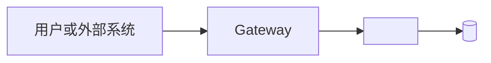
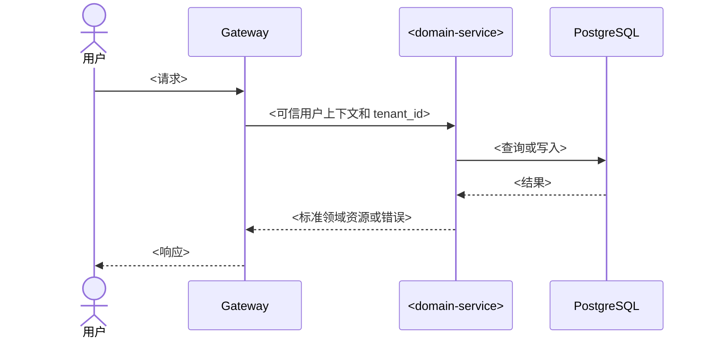
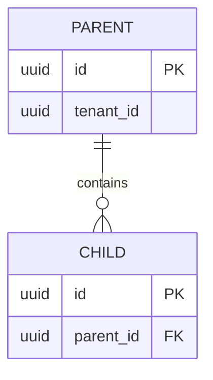

# `<功能名称>` 技术设计与开发手册

| 项目 | 内容 |
| --- | --- |
| 状态 | 草稿 / 评审中 / 已确认 / 已实现 |
| 技术负责人 | `<name>` |
| 最后更新 | `YYYY-MM-DD` |
| 关联 PRD | `docs/product/<feature>-prd.md` |
| 目标版本 | `<version>` |

## 1. 设计概述

### 1.1 设计目标

用一段话说明本次系统变化、核心技术方案和预期结果。

### 1.2 PRD 映射

| PRD 编号 | 技术实现位置 | 验证方式 |
| --- | --- | --- |
| `FR-001` | `<模块或接口>` | `TC-001` |

### 1.3 技术范围与非目标

本次实现范围：

- `<需要实现的技术能力>`

本次技术非目标：

- `<明确不实现或不调整的内容>`

### 1.4 技术约束与设计原则

以下规则默认适用于所有技术设计。任何例外都必须在本节说明原因、影响和迁移方案。

1. **接口向后兼容**：不得随意删除、重命名接口，或修改已有请求参数、响应字段的名称、类型及业务语义。新增能力优先采用兼容性扩展；破坏性变更必须通过版本升级、废弃周期和调用方迁移方案实施。
2. **数据库结构安全演进**：不得随意删除表、删除字段，或直接修改已有字段的数据类型及业务语义。数据库变更优先采用新增表、字段或索引等兼容性迁移；破坏性变更必须经过数据迁移、兼容运行、结果校验和回滚设计。
3. **领域资源对象保持统一**：每个领域资源必须定义唯一、稳定的标准响应结构。同一资源在不同接口中的字段名称、类型和语义必须一致。关联对象默认不加载，并通过 `include`、`expand` 等明确机制按需加载。创建、更新和查询条件等请求对象可以按业务场景单独定义。
4. **明确领域归属与服务边界**：设计开始前必须明确本次能力是在现有领域服务内迭代，还是创建新的领域服务。判断依据包括数据所有权、业务不变量、事务边界和领域职责，不能仅因新增数据表或 CRUD 接口而拆分服务。
5. **数据由所属领域服务写入**：每类核心数据必须有且只有一个权威领域服务。其他服务不得直接修改该服务拥有的数据表，只能通过接口或事件协作。
6. **需求、实现与测试可追踪**：技术模块、接口和测试用例应引用对应的 `FR`、`BR` 或 `AC` 编号，确保每项需求都有实现位置和验证方式。
7. **身份与租户上下文可信**：用户身份必须来自已验证的 Session。请求携带的 `tenant_id` 只能用于指定访问范围，服务仍必须验证用户与租户的有效关系，不得直接信任客户端声明。

补充本需求特有的现状、兼容性要求或基础设施约束：

- `<特殊约束；没有则写“无”>`

## 2. 系统架构与职责

### 2.1 领域与服务归属

- 归属结论：在 `<现有领域服务>` 内迭代 / 新建 `<领域服务>`。
- 判断依据：`<领域职责、数据所有权、业务不变量和事务边界>`。

### 2.2 系统架构图

使用 Mermaid 绘制具有 UML 组件图语义的系统架构图，标明用户或外部系统、Gateway、领域服务、基础设施、调用方向和数据所有权。

### 2.3 服务职责

| 服务 | 负责 | 不负责 | 拥有的数据 | 调用方或依赖 |
| --- | --- | --- | --- | --- |
| `<service>` | `<职责>` | `<明确边界>` | `<数据>` | `<调用关系>` |

### 2.4 模块与接口边界

| 提供方 | 模块或接口 | 调用方 | 职责 | 关键约束 |
| --- | --- | --- | --- | --- |
| `<service>` | `<interface>` | `<caller>` | `<用途>` | `<权限、事务或不变量>` |

本节说明“谁提供能力、谁调用、职责属于哪里”；详细接口契约统一在第 6 章定义。

## 3. 核心流程

### 3.1 流程清单

| 流程 | 参与方 | 触发条件 | 对应需求 |
| --- | --- | --- | --- |
| `<流程名称>` | `<用户或服务>` | `<条件>` | `FR-001` |

### 3.2 UML 时序图

跨服务调用、复杂事务或重要状态变化必须提供 Mermaid 时序图。图中应标明身份和租户校验、数据读写、成功响应及主要失败分支；简单 CRUD 不要求单独绘图。

### 3.3 一致性与失败处理

在对应流程下说明：

- 事务边界和数据所有权。
- 幂等与并发处理。
- 服务调用失败后的返回、重试或补偿。
- 是否涉及事件和最终一致性。

## 4. 认证、授权与租户隔离

### 4.1 身份与租户上下文

- Session Cookie 校验位置：`<service/component>`。
- 用户对象来源：`<trusted context/cache/source>`。
- `tenant_id` 来源：`<path/header>`。
- 用户与租户关系校验：`<service and rule>`。
- 下游服务获取可信用户上下文的方式：`<mechanism>`。
- 用户禁用、员工停用或离职后的失效方式：`<mechanism and timing>`。

固定要求：

- 内部接口不使用用户 Cookie，但必须使用上游传递的可信调用上下文。
- MVP 内部服务依赖私有网络互信，不引入 Service Token。
- 所有租户数据访问必须显式带入并校验 `tenant_id`。

### 4.2 权限矩阵

| 接口或资源 | 用户类型或角色 | 可访问范围 | 校验服务 | 失败响应 |
| --- | --- | --- | --- | --- |
| `<API/资源>` | `<角色>` | `<范围>` | `<service>` | 401 / 403 / 404 |

- 未认证返回 `401`。
- 已认证但无权访问返回 `403`。
- 需要隐藏资源是否存在时返回 `404`。

## 5. 数据模型

### 5.1 领域对象与数据关系图

涉及核心领域对象或数据表时，使用 Mermaid `classDiagram` 或 `erDiagram` 表达对象、关系、基数、聚合归属及主要表映射。

存在明确生命周期时，补充 `stateDiagram-v2` 状态图；没有状态变化时不需要绘制。

### 5.2 标准领域资源对象

| 字段 | 类型 | 必有 | 说明 | 加载方式 |
| --- | --- | --- | --- | --- |
| `id` | UUID | 是 | 资源标识 | 默认 |
| `<object>` | Object | 否 | 嵌套领域资源 | `include/expand` |

### 5.3 表结构

#### `<table_name>`

| 字段 | 类型 | 可空 | 默认值 | 约束 | 说明 |
| --- | --- | --- | --- | --- | --- |
| `id` | `uuid` | 否 |  | PK | `<说明>` |

每张表按需补充：

- 主键、外键、唯一约束和检查约束。
- 索引及对应查询场景。
- `tenant_id` 隔离规则。
- 软删除及数据保留规则。

### 5.4 状态、并发与迁移

- 合法状态变化：`<规则；不涉及则删除>`。
- 唯一性和幂等规则：`<规则>`。
- 乐观锁或并发冲突处理：`<规则>`。
- 数据库迁移和新旧版本兼容方式：`<方案>`。
- 数据回填、回滚或不可逆操作：`<方案；不涉及则写“无”>`。

## 6. 接口与集成设计

### 6.1 接口通用约定

按需说明 API 版本与路径、Session 和可信上下文、`tenant_id`、分页、排序、筛选、时间格式、标准错误结构、`include/expand`、幂等键、请求追踪及兼容策略。

### 6.2 接口清单

| 编号 | 类型 | 方法与路径或事件 | 调用方 | 权限 | 对应需求 |
| --- | --- | --- | --- | --- | --- |
| API-001 | 用户接口 | `GET /api/v1/...` | Web / App | `<权限>` | FR-001 |
| API-002 | 内部接口 | `POST /internal/v1/...` | `<service>` | 内部网络 | FR-002 |

### 6.3 接口详细设计

#### API-001 `<接口名称>`

- 方法与路径：`GET /api/v1/...`
- 调用方：`<用户或服务>`
- 认证与权限：`<规则>`
- Tenant 来源：`<path/header>`
- 对应需求：`FR-001 / BR-001 / AC-001`
- 幂等与并发：`<规则；不涉及则写“无”>`

请求参数：

| 参数 | 位置 | 类型 | 必填 | 校验规则 | 说明 |
| --- | --- | --- | --- | --- | --- |
| `<name>` | Path / Query / Header / Body | `<type>` | 是 / 否 | `<rule>` | `<说明>` |

响应字段：

| 字段 | 类型 | 必有 | 说明 |
| --- | --- | --- | --- |
| `<field>` | `<type>` | 是 / 否 | `<说明或标准领域资源引用>` |

错误响应：

| HTTP 状态 | 业务错误码 | 触发条件 |
| --- | --- | --- |
| 409 | `<DOMAIN_ERROR>` | `<condition>` |

### 6.4 其他集成

事件、批量导入或第三方调用只有实际涉及时才填写，并明确契约、触发条件、幂等键、事务边界和失败处理。接口发布涉及特殊兼容顺序或回滚要求时，也在本节说明。

## 7. 测试用例与验收标准

### 7.1 需求覆盖矩阵

| PRD 编号 | 实现模块或接口 | 测试用例 |
| --- | --- | --- |
| `FR-001 / BR-001 / AC-001` | `API-001` | `TC-001` |

### 7.2 测试用例

| 编号 | 层级 | 场景 | 前置条件 | 操作 | 预期结果 |
| --- | --- | --- | --- | --- | --- |
| TC-001 | 单元 / 模块 / API / 集成 / 架构 / 端到端 | `<场景>` | `<条件>` | `<步骤>` | `<可观察结果>` |

复杂测试可以在表格后补充完整的 Given / When / Then 步骤。

### 7.3 必测范围

根据功能实际情况覆盖：

- 正常流程、参数校验和业务规则。
- 用户权限和租户数据隔离。
- 用户禁用、员工停用或离职后的访问阻断。
- 接口和数据库迁移的向后兼容。
- 并发、幂等和服务调用失败。
- 批量导入及错误恢复。

### 7.4 完成要求

- 所有 P0 功能需求必须有对应测试。
- PRD 验收标准必须全部覆盖。
- 接口及数据库兼容性必须验证。
- 权限和租户隔离必须验证。
- 架构图、数据模型和接口文档必须与最终实现一致。

测试执行状态和结果由自动化测试、关联 Issue 或 Pull Request 记录，不在本文档中维护勾选状态。
